---
## Author
author:
  name: Мещерякова София Андреевна
  affiliation:
    - name: Российский университет дружбы народов
      country: Российская Федерация
      postal-code: 117198
      city: Москва
      address: ул. Миклухо-Маклая, д. 6
      
## Title
title: "Прохождение внешнего курса. Этап 1"
subtitle: "Введение"
license: "CC BY"
---

# Цель работы

Освоить основы работы в операционной системе Linux.

# Выполнение заданий

1. Название курса - введение в Linux ([рис. @fig-001])

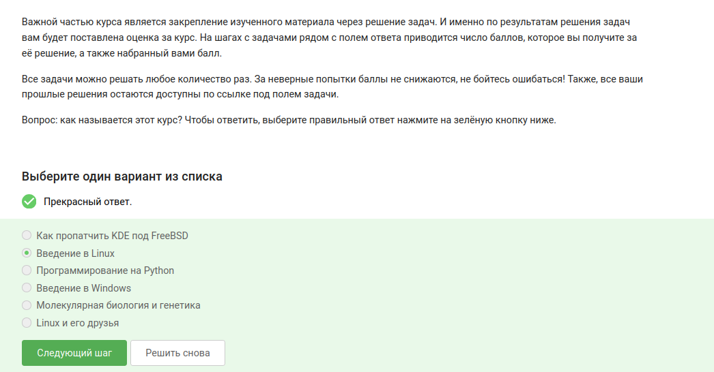{#fig-001 width=70%}

2. Выбрать правила прохождения курса ([рис. @fig-002])

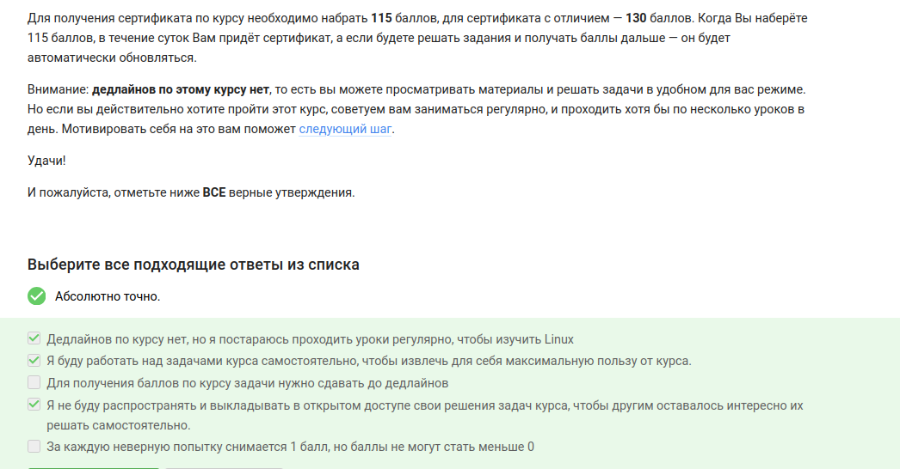{#fig-002 width=70%}

3. Выбор используемых мной ОС ([рис. @fig-003])

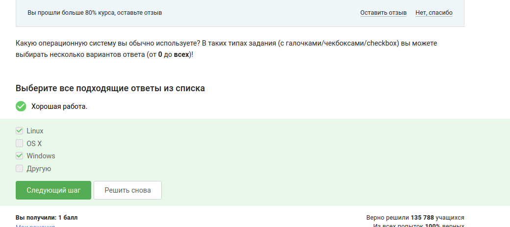{#fig-003 width=70%}

4. Определение вируальной машины ([рис. @fig-004])

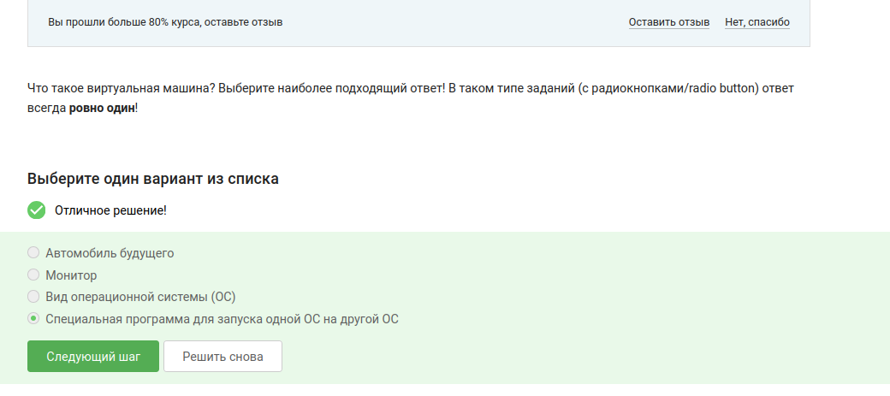{#fig-004 width=70%}

5. Запуск линукса на собственном компьтере ([рис. @fig-005])

{#fig-005 width=70%}

6. Ввести необходимый текст в файл, выбрать шрифт по заданию, при сохранении выбрать формат xml ([рис. @fig-006])

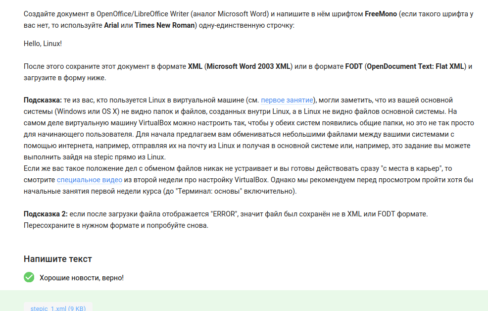{#fig-006 width=70%}

7. Расширение установочных пакетов в Ubuntu -- deb([рис. @fig-007])

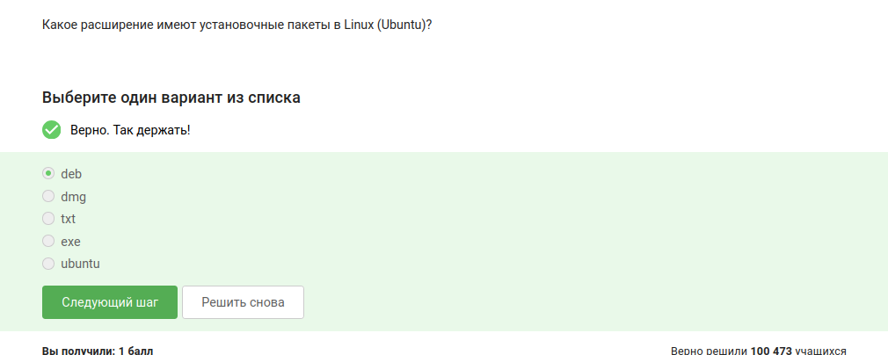{#fig-007 width=70%}

8. По инструкции найти первую фамилию в списке разработчиков ([рис. @fig-008)

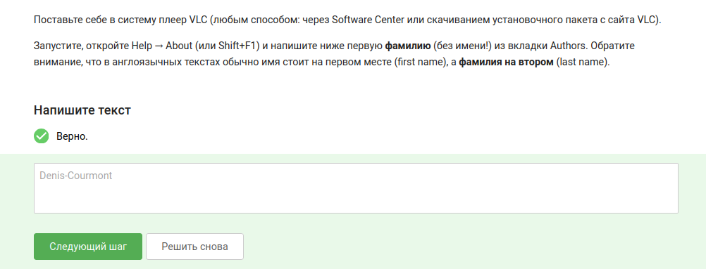{#fig-008 width=70%}

9. Update maneger -- программа для управления обновлениями (верны все ответы связанные с обновлением) ([рис. @fig-009])

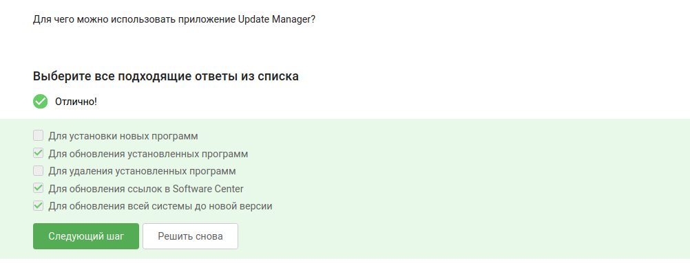{#fig-009 width=70%}

10. ([рис. @fig-010])

{#fig-010 width=70%}

11. ([рис. @fig-011])

{#fig-011 width=70%}

12. ([рис. @fig-012])

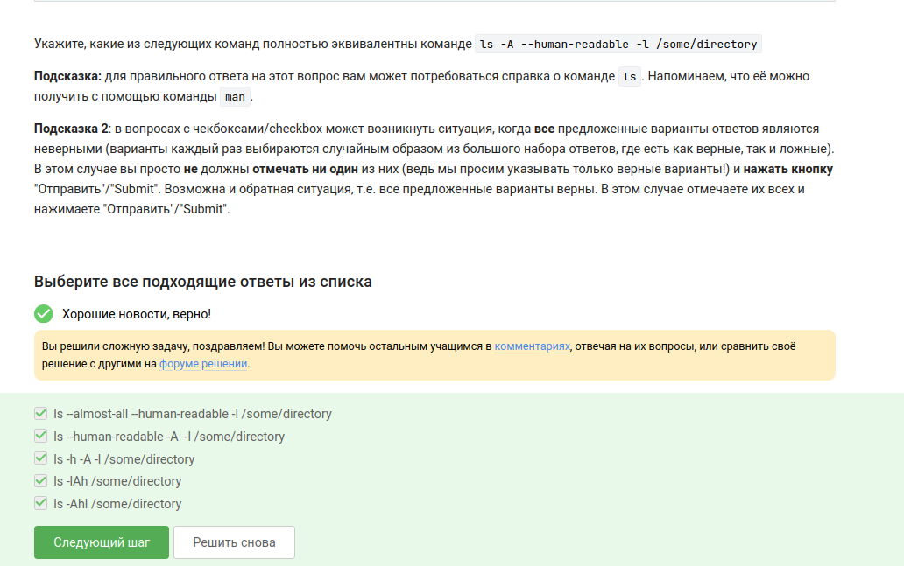{#fig-012 width=70%} 

13. ([рис. @fig-013])

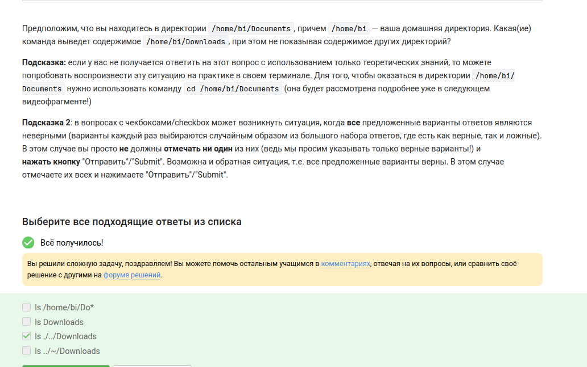{#fig-013 width=70%} 

14. ([рис. @fig-014])

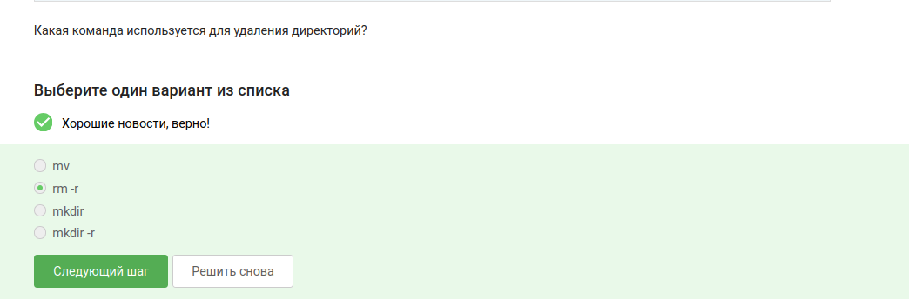{#fig-014 width=70%} 

15. Ввод команд firefox, затем exit не закроет ни браузер, ни терминал ([рис. @fig-015])

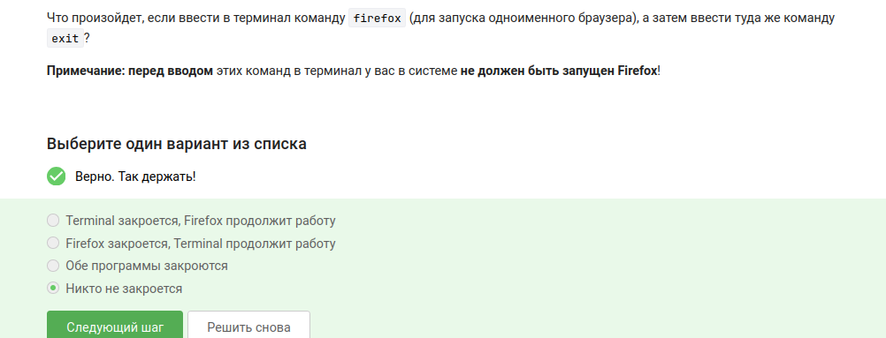{#fig-015 width=70%}

16.Чему эквивалентен запуск программы с &? Запуск, Ctrl+Z, bg

Символ & в конце команды запускает процесс сразу в фоновом режиме (background).Последовательность действий во взятом варианте делает то же самое пошагово:Вы запускаете программу в обычном (интерактивном) режиме. Нажатие Ctrl+Z приостанавливает (замораживает) текущий активный процесс. Команда bg (background) возобновляет выполнение этого приостановленного процесса, но уже в фоне. ([рис. @fig-016])

{#fig-016 width=70%}

17. Запускаем файл с программой, предварительно добавив возможность исполнение файла, копируем вывод, получившийся при запуске программы ([рис. @fig-017])

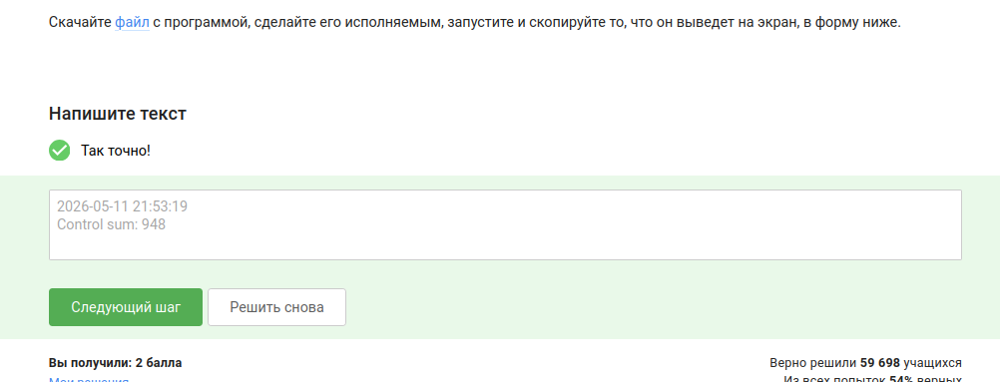{#fig-017 width=70%}

18. Поток ошибок из программы, запущенной в терминале, по умолчанию выводится на экран ([рис. @fig-018])

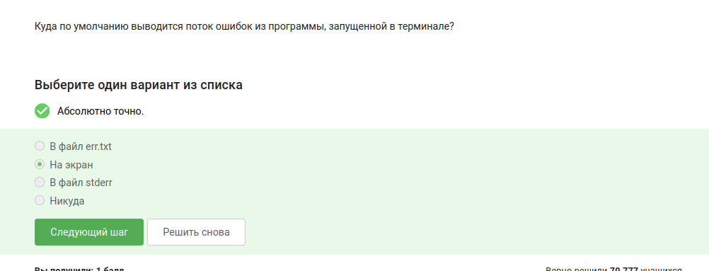{#fig-018 width=70%}

19. Какие (какая) из команд создадут файл file.txt и запишут в него поток ошибок программы program? Считайте, что в момент запуска программы файл file.txt не существует.

В Linux стандартный поток ошибок (stderr) имеет дескриптор 2:Оператор 2> перезаписывает файл (или создает новый, если его нет), направляя туда ошибки.Оператор 2>> дописывает ошибки в конец файла (или создает его, если он отсутствует). Поскольку в условии сказано, что файла изначально нет, оба варианта приведут к одинаковому результату — созданию файла с потоком ошибок.([рис. @fig-019])

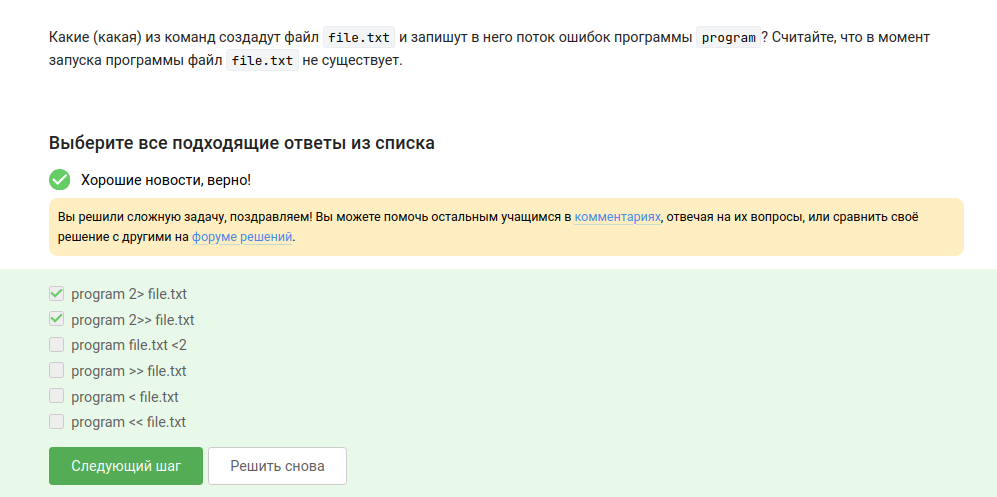{#fig-019 width=70%}

20. Куда деваются сообщения об ошибках (т.е. вывод в stderr) от тех программ, которые объединены в конвейер (pipe)? Сообщения об ошибках в этом случае выводятся на экран. ([рис. @fig-020])

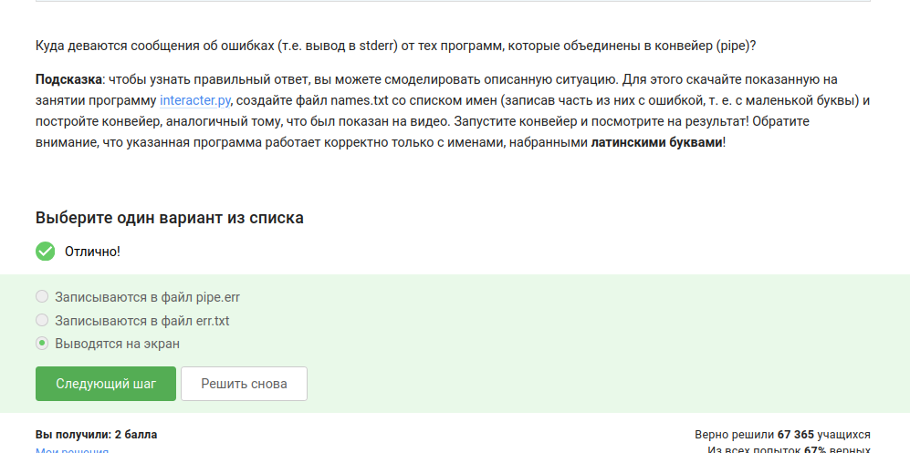{#fig-020 width=70%}

21. В каком файле на диске окажется картинка, если для её скачивания были выполнены следующие команды?

cd /home/alex/

wget -P /home/alex/Pictures -O 1.jpg http://example.com/example.jpg

Сохранение происходит в файл 1.jpg в текущей папке /home/alex/. ([рис. @fig-021])

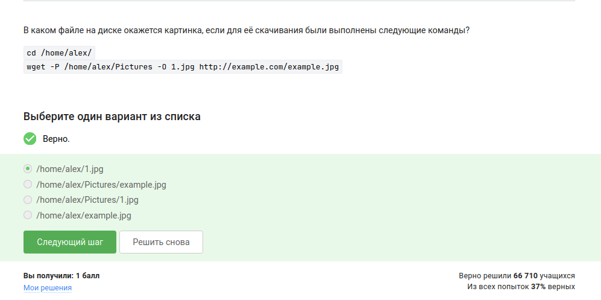{#fig-021 width=70%}

22. Какую опцию нужно указать команде wget, чтобы она не выводила никаких сообщений на экран (Resolving.., Connecting to.. и т.д.)?

Подсказка: для ответа на этот вопрос вам понадобится справка по команде wget, которую легко можно получить, набрав man wget.([рис. @fig-022])

-q / --quiet — полностью отключает (переводит в «тихий» режим) вывод wget. На экран не будут выводиться сообщения о поиске хоста (Resolving), подключении (Connecting) и шкала прогресса скачивания.

-nv / --no-verbose — отключает подробный вывод, но базовые сообщения и сообщения об ошибках всё равно будут отображаться на экране.

-v / --verbose — наоборот, включает максимально подробный режим вывода (он активен по умолчанию).

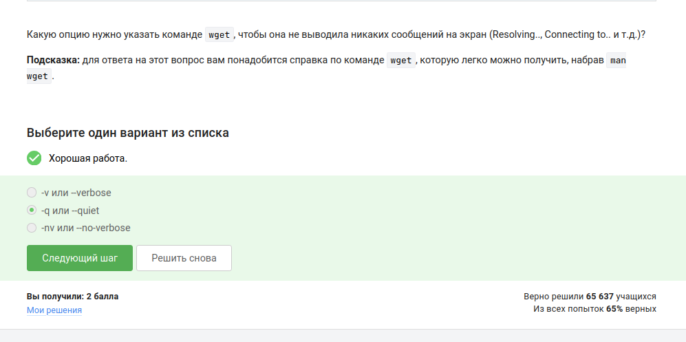{#fig-022 width=70%}

23. Пусть на некоторой web-странице есть ссылки на картинки в форматах png и jpg, а также ссылки на другие страницы сайта (обычные html файлы). Какие файлы будут скачаны на компьютер, если запустить wget -r -l 1 -A jpg и передать в качестве аргумента ссылку на эту web-страницу? ([рис. @fig-023])

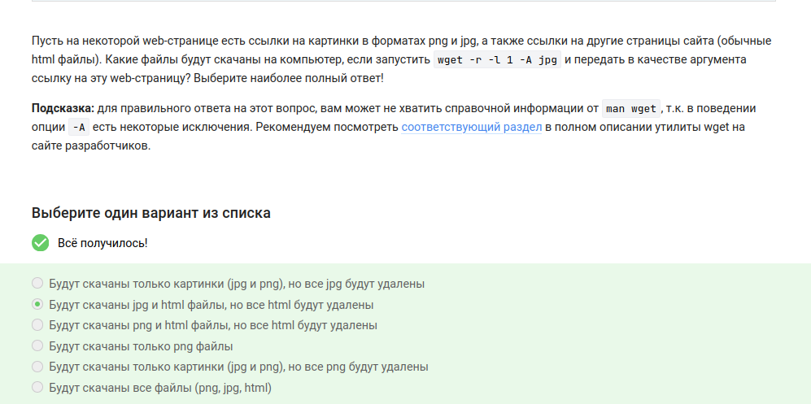{#fig-023 width=70%}

24. Чем отличаются архиваторы gzip и zip? ([рис. @fig-024])

zip — это полноценный архиватор. Он умеет сжимать данные и одновременно объединять множество файлов и папок в один архив.

gzip — это строго компрессор (утилита сжатия). Он умеет сжимать только один конкретный файл. Он не умеет объединять папки. Чтобы сжать папку с помощью gzip, её сначала объединяют в один файл утилитой tar (получается формат .tar.gz).

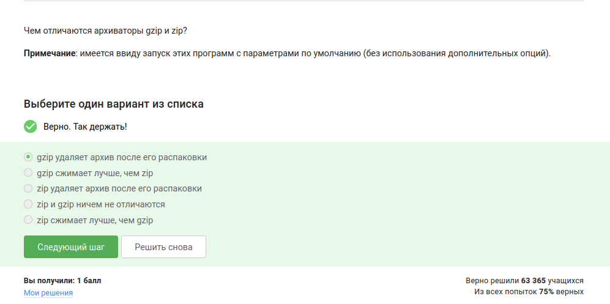{#fig-024 width=70%}

25. Какие из перечисленных программ-архиваторов могут создать архив из директории с файлами? ([рис. @fig-025])

zip — является полноценным архиватором. Он умеет рекурсивно обходить директории (с флагом -r), упаковывать структуру папок и сжимать файлы в один архив.

tar — изначально создан для объединения множества файлов и целых директорий в один общий файл (архив). Он также умеет сжимать их с помощью встроенных флагов.

gzip — умеет работать только с одиночными файлами. При попытке передать ему директорию он выдаст ошибку gzip: my_directory is a directory -- ignored. Для работы с директориями его всегда используют в связке с tar.

{#fig-025 width=70%}

26. Какой набор опций нужно указать программе tar, чтобы запаковать файлы в my_archive.tar.bz2? ([рис. @fig-026])

-c (create) — указывает создать новый архив.

-j (bzip2) — указывает сжать создаваемый архив с помощью алгоритма bzip2 (что как раз и дает расширение .tar.bz2).

-f (file) — указывает, что далее следует имя файла архива (my_archive.tar.bz2).

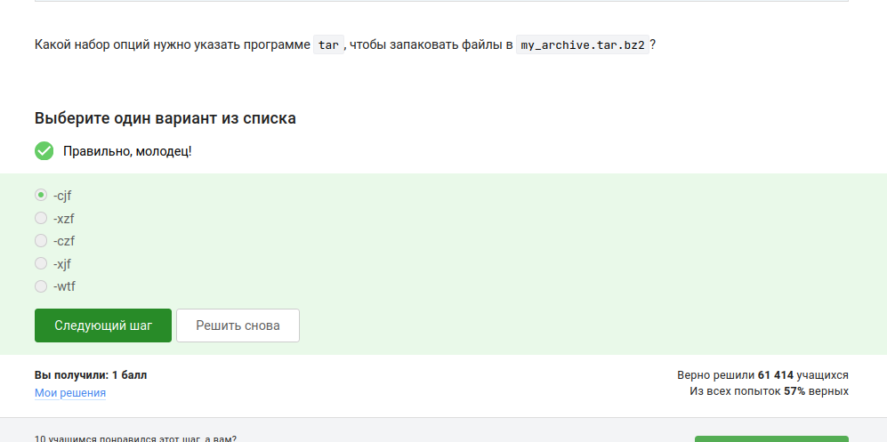{#fig-026 width=70%}

27. Какая маска команды find НЕ найдет файл Alexey.jpeg? ([рис. @fig-027])

- *.jpg —  Расширение файла .jpeg (четыре буквы), а маска ищет строго .jpg (три буквы).

- alexey.* — НЕ найдет. Утилита find чувствительна к регистру. Файл начинается с заглавной буквы A, а маска предлагает строчную a.

- *.? — НЕ найдет. Знак вопроса ? заменяет ровно один любой символ. Эта маска ищет файлы, у которых расширение состоит строго из одной буквы (например, file.c), а у нас четыре буквы (jpeg).

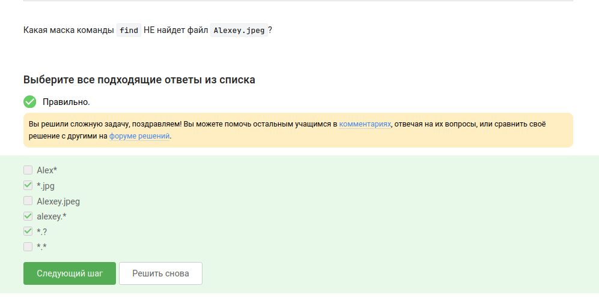{#fig-027 width=70%}

28. Предположим, что в файле  text.txt записаны строки, показанные среди вариантов ответа. Отметьте только те из них, которые выведет на экран команда  grep "world" text.txt.
([рис. @fig-028])

Выбираем все варианты где есть сочетание "world" с маленькой буквы.

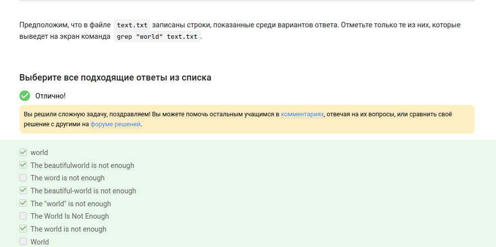{#fig-028 width=70%}

29. Cкачайте архив с произведениями Шекспира. Вам нужно сгенерировать файл, в котором будут все строчки из этих произведений, содержащие “love”, и загрузить этот файл в форму. ([рис. @fig-029])

скачиваем и разархивируем каталог. С помощью команды grep>fileSH.txt "love" -r  ~/Shakespeare/ создаем нужный файл.

{#fig-029 width=70%}

# Выводы

Выполнен первый этап курса. Мы научились основам работы в терминале.

# Список литературы{.unnumbered}

::: {#refs}
:::
