---
## Author
author:
  name: Мещерякова София Андреевна
  affiliation:
    - name: Российский университет дружбы народов
      country: Российская Федерация
      postal-code: 117198
      city: Москва
      address: ул. Миклухо-Маклая, д. 6
      
## Title
title: "Прохождение внешнего курса. Этап 3"
subtitle: "Продвинутые темы"
license: "CC BY"
---

# Цель работы

Выполнить третий этап курса "Введение в Linux". Освоить продвинуты темы для работы в ОС Linux.

# Выполнение заданий

## Текстовый редактор vim

Чтобы выйти без сохранения, нужно перейти в режим команд строки (:), ввести q (quit) и нажать Enter ([рис. @fig-001]).

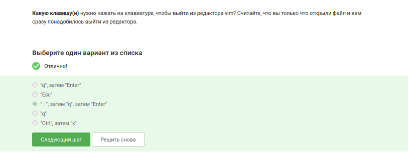{#fig-001 width=70%}

word — это последовательность букв, цифр и знаков подчеркивания (_) ИЛИ последовательность других символов (знаков препинания). WORD — это любая последовательность символов, разделенная исключительно пробелами или символами табуляции/конца строки.([рис. @fig-002]).

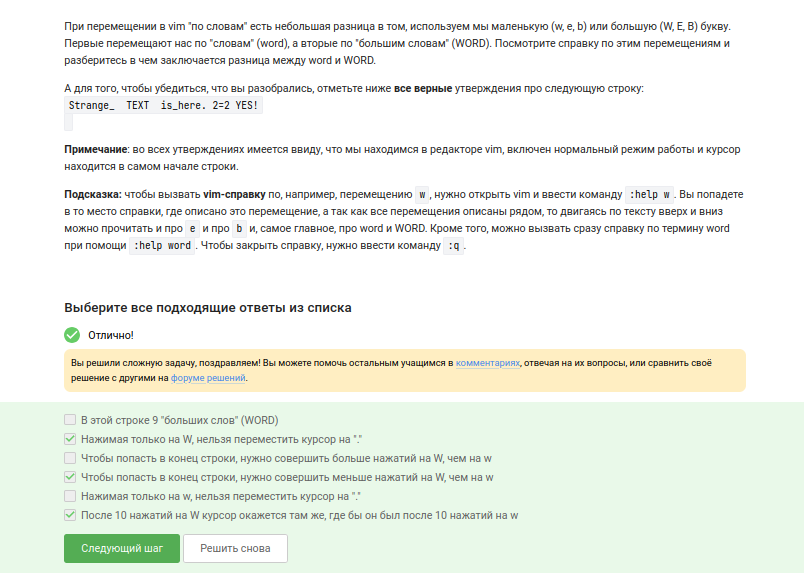{#fig-002 width=70%}

Исходная строка: one two three four five
Цель: three four four four five (курсор изначально на первой букве o).

- xxxxxxxxwywPpxxxxxxxx: удаляет 8 символов поочередно (one two ). Строка становится three four five, курсор на t.w: перемещает курсор на four.yw: копирует (yank) слово four с пробелом.P: вставляет скопированное перед four (получается four four).p: вставляет еще раз после (получается four four four).

- d2wwywPpd2w: удаляет два слова (one  и two ). Строка: three four five.w: прыгает на слово four.yw: копирует four .P и p: вставляют его до и после текущего слова, доводя количество four до трёх.

- d2wwifour four <Esc>d2w: удаляет one two . Строка: three four five.w: перемещает курсор на слово four.ifour four <Esc>: переходит в режим вставки перед словом и дописывает нехватающие four four 

- d2w$bifour four <Esc>d2w: удаляет one two . Строка: three four five.$: прыгает в самый конец строки (на слово five).b: возвращается назад на одно слово (на four).ifour four <Esc>: вставляет текст перед ним.

- ddithree four four four five <Esc>dd: полностью удаляет всю текущую строку.ithree four four four five <Esc>: переходит в режим вставки в пустую строку и просто пишет требуемый текст целиком с нуля. ([рис. @fig-003]).

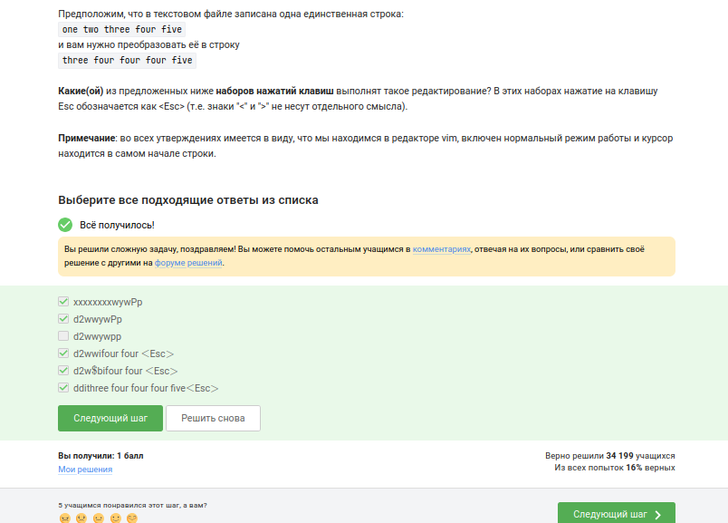{#fig-003 width=70%}

:%s — замена во всех строках, шаблон Windows, замена Linux. Без флага g заменяется только первое вхождение в строке. Enter не входит в команду ([рис. @fig-004]).

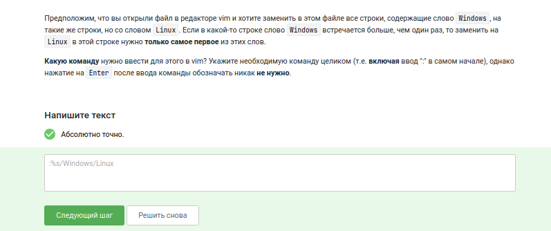{#fig-004 width=70%}

* Выйти из режима выделения можно, нажав клавишу Esc два раза
(Иногда достаточно и одного нажатия, но двойной Esc гарантированно возвращает в нормальный режим из любого состояния).
* В режиме выделения можно использовать команды перемещения (например, W, e, $, и др.)
(При перемещении курсора выделенная область будет автоматически расширяться или сужаться).
* В режиме выделения можно использовать команды d (удалить) и y (скопировать)
(Они применятся ко всему тексту, который попал в область выделения).
* Режим выделения открывается из нормального режима по нажатию "v"
(Маленькая v включает посимвольный визуальный режим, V — построчный, а Ctrl+V — блочный).
* Когда вы находитесь в режиме выделения, внизу редактора горит надпись -- VISUAL -- (или -- ВИЗУАЛЬНЫЙ РЕЖИМ --)


Почему не подходит оставшийся вариант:

* Чтобы выйти из режима выделения, нужно ввести :q — Это неверно. Команда :q используется в командном режиме для выхода из самого редактора Vim, а не для смены режимов ([рис. @fig-005]).

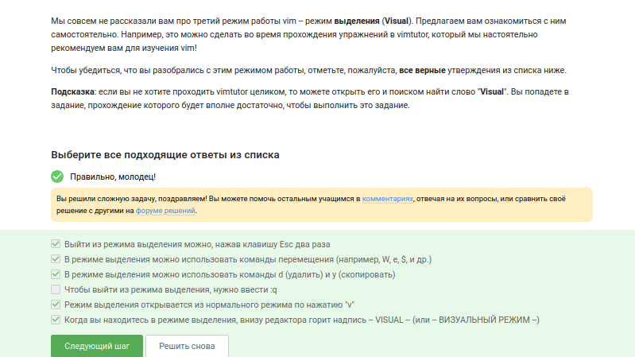{#fig-005 width=70%}

## Скрипты на bash: основы

История команд привязана к текущей оболочке. Запуск новой оболочки (sh, затем bash) даёт новую историю ([рис. @fig-006]).

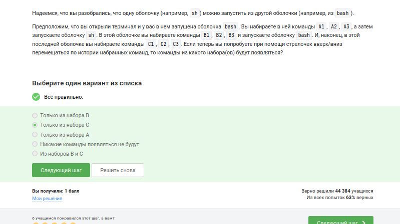{#fig-006 width=70%}

Команда cd меняет директорию только внутри скрипта, но файл создаётся в /home/bi/ ([рис. @fig-007]).

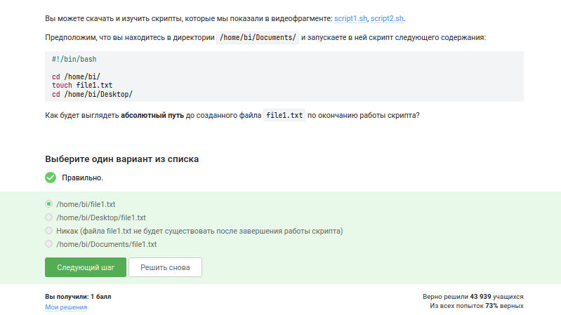{#fig-007 width=70%}

Правила именования переменных в bash ([рис. @fig-008]):

   1. Имя должно состоять только из букв (a-z, A-Z), цифр (0-9) и знаков подчеркивания (_).
   2. Имя может начинаться только с буквы или со знака подчеркивания. Цифра на первом месте недопустима.
   3. Символы пробела, точек, знаков доллара или коммерческого «at» (@) в именах переменных запрещены.

не подходят варианты:

* var i able — содержит пробелы.
* var.i.able — содержит точки.
* variab$$le — содержит знаки $.
* var@iable — содержит символ @.

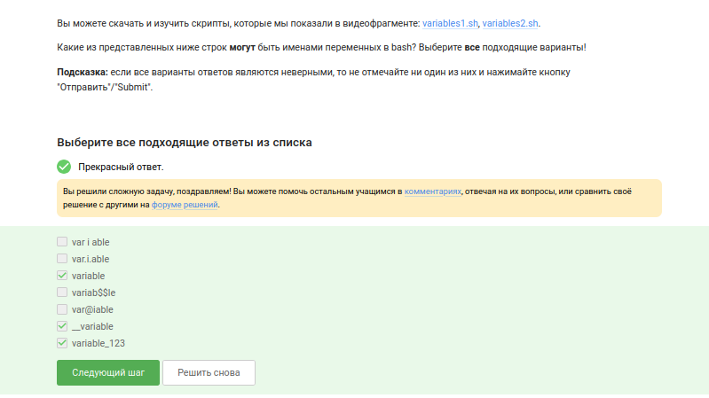{#fig-008 width=70%}

$1 и $2 — аргументы скрипта. Чтобы вывести символ $ как текст, его нужно экранировать \$. Первый вариант (\$1=$1) выведет $1=значение ([рис. @fig-009]).

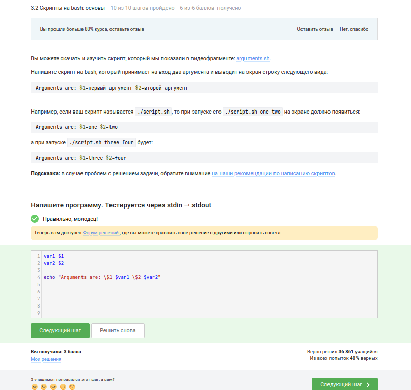{#fig-009 width=70%}

## Скрипты на bash: ветвления и циклы

Верные:

* 5 -ge 5
* -s $0
* $# -ge 0
* -e $0
* ! (4 -le 3)

Неверно:
* $# -gt 0 — Условие истинно только тогда, когда количество аргументов строго больше нуля (-gt, greater than). Если запустить скрипт вообще без параметров, это условие вернет ложь ([рис. @fig-010]).

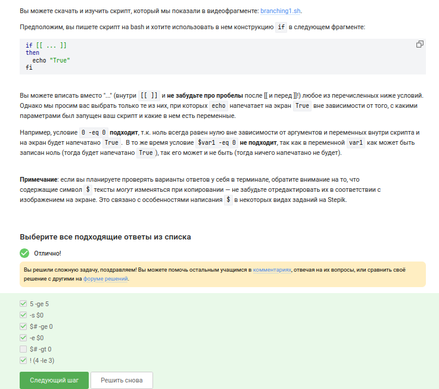{#fig-010 width=70%}

Правильным вариантом ответа является:

* Сначала four, потом four ([рис. @fig-011]).

В скрипте используются следующие числовые операторы сравнения:

* -gt (greater than) — строго больше.
* -lt (less than) — строго меньше.
* -eq (equal) — равно.

1. Первый запуск при var = 3:

* if [[ 3 -gt 5 ]] ➔ Ложь (3 не больше 5).
* elif [[ 3 -lt 3 ]] ➔ Ложь (3 не меньше 3, они равны).
* elif [[ 3 -eq 4 ]] ➔ Ложь (3 не равно 4).
* Выполняется ветка else ➔ выводится four.

2. Второй запуск при var = 5:

* if [[ 5 -gt 5 ]] ➔ Ложь (5 не больше 5, они равны).
* elif [[ 5 -lt 3 ]] ➔ Ложь (5 не меньше 3).
* elif [[ 5 -eq 4 ]] ➔ Ложь (5 не равно 4).
* Снова выполняется ветка else ➔ выводится four.


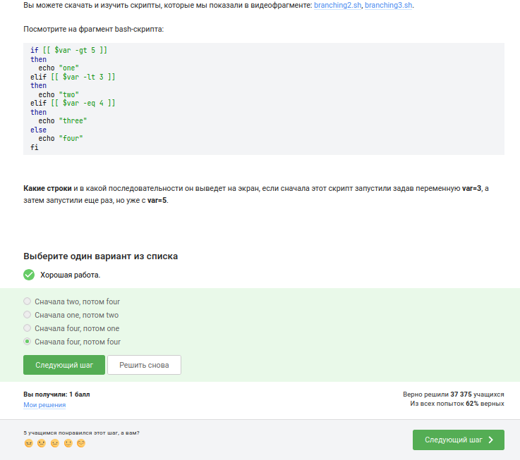{#fig-011 width=70%}

Конструкция проверяет число студентов и выводит нужное сообщение. Для 2–4 выводится число с "students". Для 0 особая строка. Для 5 и больше — "A lot of students" ([рис. @fig-012]).

```
if [[ $1 -eq 1 ]]; then
    echo "$1 student"
elif [[ $1 -gt 1 && $1 -le 4 ]]; then
    echo "$1 students"
elif [[ $1 -ge 5 ]]; then
    echo "A lot of students"
else
    echo "No students"
fi
```

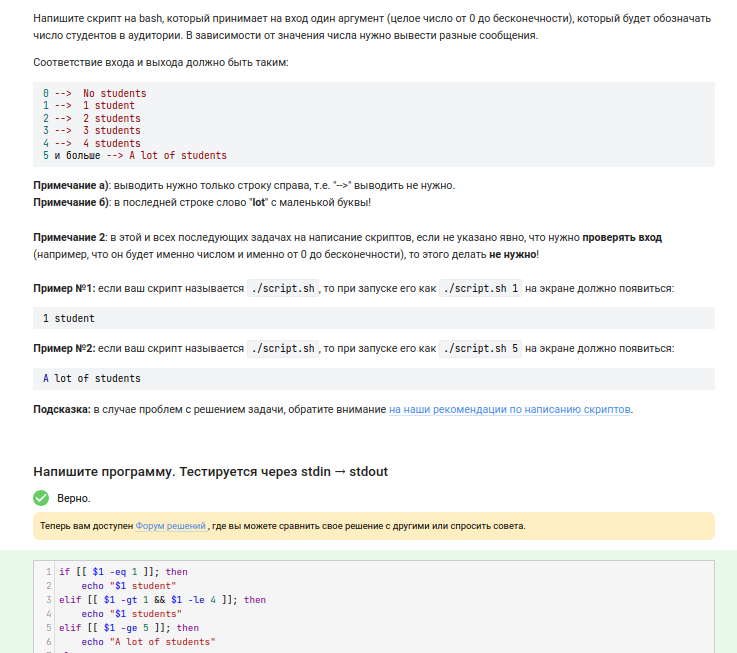{#fig-012 width=70%}

Цикл for перебирает три строки: "a,", "b," и "c_d". continue пропускает вывод "finish" для строк, которые лексикографически больше "c". "c_d" > "c", поэтому для неё "finish" не выводится. Остальные строки выводят и "start", и "finish". Итог: "start" — 5 раз, "finish" — 4 раза ([рис. @fig-013]).

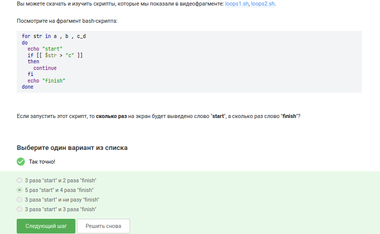{#fig-013 width=70%}

Бесконечный цикл while true. При пустом имени или возрасте 0 — выход с bye. Иначе определение группы ([рис. @fig-014]).

```
# put your shell (bash) code here
child=16
adult=25
s=0

while [[ $s != 1 ]]
    do
        echo "enter your name: "
        read name
    if [[ -z $name ]]; then
        echo "bye"
        s=1
    elif [[ -n $name ]]; then
        echo "enter your age: "
        read age
        if [[ $age -eq 0 ]]; then
            echo "bye"
            s=1
        elif [[ $age -le $child ]]; then
            echo "$name, your group is child"
        elif [[ $age -gt $adult ]]; then
             echo "$name, your group is adult"
        else 
            echo "$name, your group is youth"
        fi
    fi
done

```

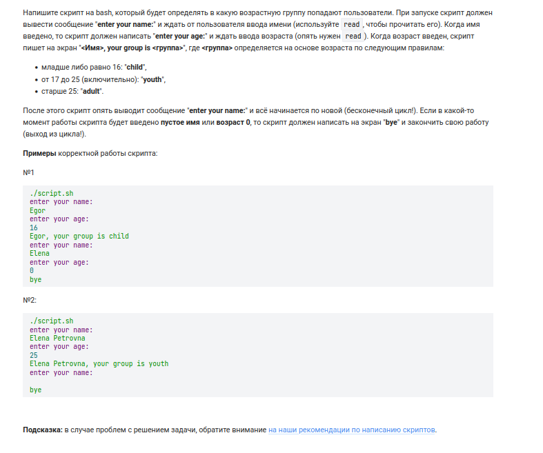{#fig-014 width=70%}


## Скрипты на bash: разное

Команда let в bash создана специально для вычисления арифметических выражений. Она автоматически интерпретирует текст как математическую операцию и позволяет опускать знак доллара $ перед именами переменных:

   1. let a=a+b и let a=$a+$b — классический синтаксис без пробелов.
   2. let "a+=b" и let "a=$a+$b" — использование двойных кавычек позволяет безопасно экранировать специальные символы (включая пробелы, если бы они там были), при этом bash успешно раскрывает значения переменных внутри кавычек.

* a=$a+$b — без встроенной математической команды (вроде let или конструкции $((...))) bash воспринимает это выражение как обычное сложение строк. Вместо числа 15 в переменную a запишется строка 10+5 ([рис. @fig-015]).

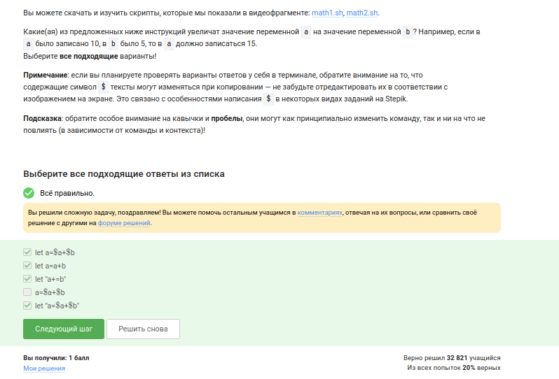{#fig-015 width=70%}

Команда echo "'pwd'" выводит текущую директорию, результат выполнения pwd ([рис. @fig-016]).

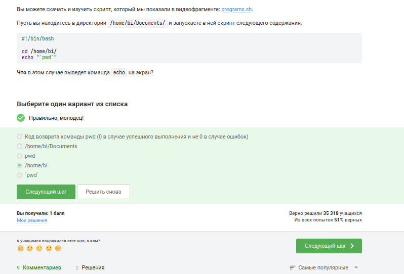{#fig-016 width=70%}

Правильными утверждениями и конструкциями в bash являются следующие варианты:

* if \program` > some_file.txt`
* Сначала запустить program, затем if [[ $? -eq 0 ]]

   1. **if \program` > some_file.txt** Перенаправление вывода > some_file.txtперехватывает весь текст, который программа пишет вstdout, и убирает его с экрана, сохраняя в файл. При этом конструкция if` по-прежнему проверяет именно код возврата самой программы (если он равен 0, условие выполнится).
   2. Сначала запустить program, затем if [[ $? -eq 0 ]]
   Это классический и самый надежный способ. Переменная $? автоматически сохраняет код возврата последней выполненной команды. Вы можете запустить программу привычным образом, а следующей строкой проверить, завершилась ли она успешно (код 0).

остальные варианты:

* **Сначала var=\program`, затем if [[ $var -eq 0 ]]** — Косая кавычка (backtick) сохраняет в переменную var**текстовый вывод** программы (stdout), а не код её завершения. Если программа выведет слово "Привет", условие[[ "Привет" -eq 0 ]]` вызовет ошибку или отработает некорректно.
* **if [[ \program` -eq 0 ]]** — По той же причине: внутри [[ ... ]]` будет сравниваться число 0 и текстовый вывод программы, а не код возврата ([рис. @fig-017]).

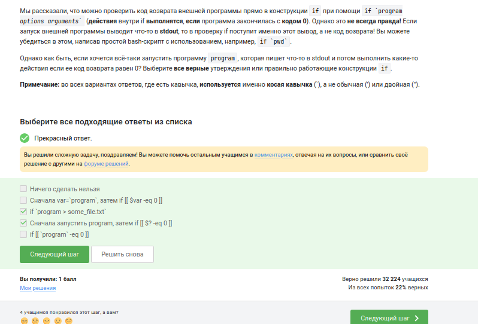{#fig-017 width=70%}

В функции counter переменная c1 объявлена как local, поэтому её значение не сохраняется между вызовами — после десяти вызовов c1 остаётся пустой. Нелокальная переменная c2 накапливает сумму: 2*(1+2+…+10)=110. Команда echo выводит "counters are  and 110" (между are и and — два пробела) ([рис. @fig-018]).

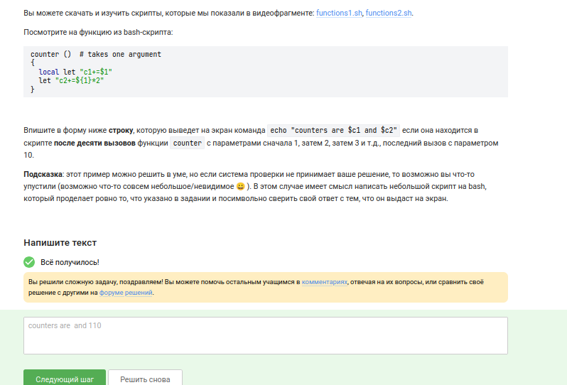{#fig-018 width=70%}

Бесконечный цикл чтения двух чисел. Пустая строка — выход. Функция gcd реализует алгоритм Евклида ([рис. @fig-019]).

```
# put your shell (bash) code here
while [ true ] 
do
    read n1 n2
if [ -z $n1]; then
    echo "bye"
    break
else 
    gcd () {
    r=1
    if [ $n2 -eq 0 ]
    then
    echo "bye"
    fi
    while [ $r -ne 0 ]
    do
    r=$((n1%n2))
    n1=$n2
    n2=$r
    done
    }
    gcd $1 $2
    echo "GCD is $n1"
fi
done
```

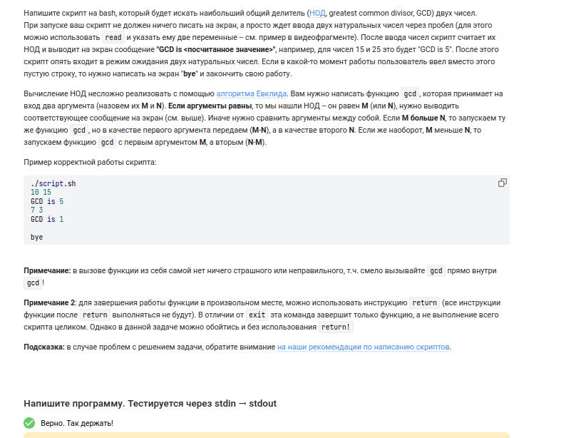{#fig-019 width=70%}

$((exp)) вычисляет арифметическое выражение. Если выражение неверно — ошибка и выход. exit — выход с bye ([рис. @fig-020]).

```
# put your shell (bash) code here
while [[ true ]]
do
    read a zn b
    if [[ $a == "exit" ]]
    then 
        echo "bye"
        break
    elif [[ "$a" =~ "^[0-9]+$" &&  "$b" =~ "^[0-9]+$" ]]
    then 
        echo "error"
        break
    else
        case $zn in
        "+") let "res = a + b";;
        "-") let "res = a - b";;
        "*") let "res = a * b";;
        "/") let "res = a / b";;
        "%") let "res = a % b";;
        "**") let "res = a ** b";;
        *) echo "error"; break ;;
        esac
        echo "$res"
    fi
done
```

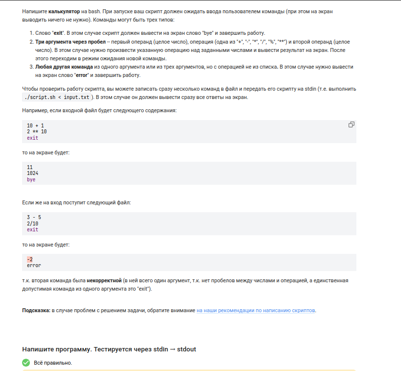{#fig-020 width=70%}

## Продвинутый поиск и редактирование

-iname ищет без учёта регистра, -name — с учётом ([рис. @fig-021]).

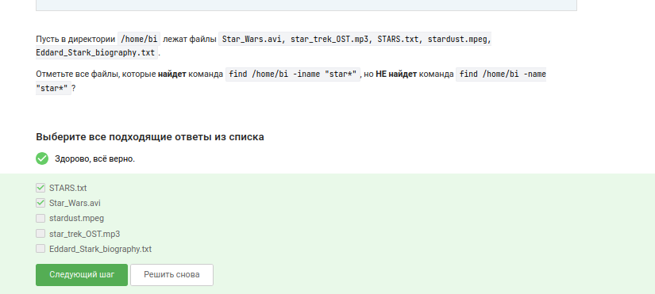{#fig-021 width=70%}

-path ищет по полному пути, -name только по имени. В некоторых случаях (файл в текущей директории) результат совпадёт, но не всегда ([рис. @fig-022]).

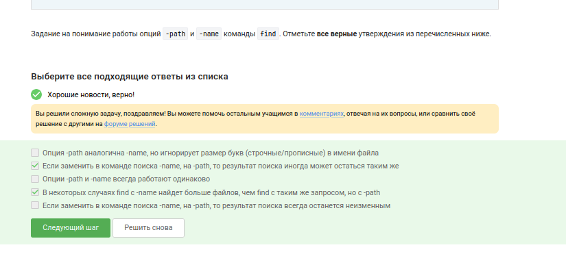{#fig-022 width=70%}

Команда find с параметрами -mindepth 2 -maxdepth 3 ищет файлы на глубине 2 и 3 относительно /home/bi/.
file1 находится на глубине 2 (/home/bi/dir1/file1), file2 — на глубине 3 (/home/bi/dir1/dir2/file2), file3 — на глубине 4 (/home/bi/dir1/dir2/dir3/file3).
Будут найдены file1 и file2 — все, кроме file3 ([рис. @fig-023]).

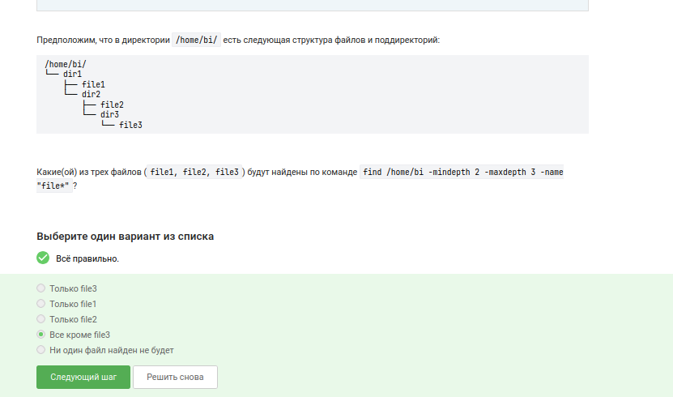{#fig-023 width=70%}

Во всех вариантах grep выводит одинаковое количество строк, так как каждая строка файла содержит слово "word". Опции -A, -B, -C добавляют контекст, но поскольку искомая строка есть в каждой строке, добавленные строки контекста совпадают с уже выводимыми. В итоге все команды создадут файл results.txt одинакового размера ([рис. @fig-024]).

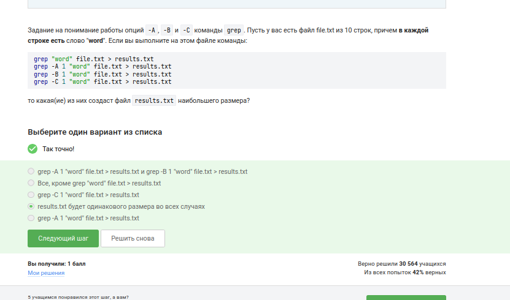{#fig-024 width=70%}

Регулярное выражение ищет строки, которые оканчиваются на buntu. Перед buntu может быть буква u или цифра 0, а перед ними — необязательный символ из указанного набора ([рис. @fig-025]).

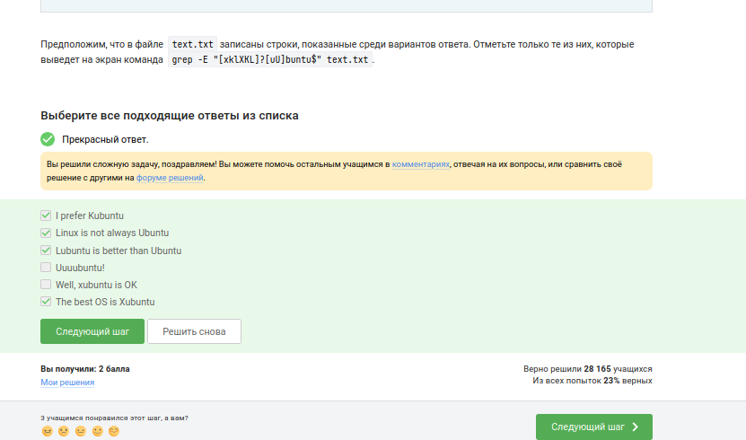{#fig-025 width=70%}

Без опции -n sed печатает каждую строку по умолчанию, а команда p печатает её ещё раз. Строки, соответствующие шаблону [a-z]* (хотя бы одна строчная буква), выводятся дважды. ([рис. @fig-026]).

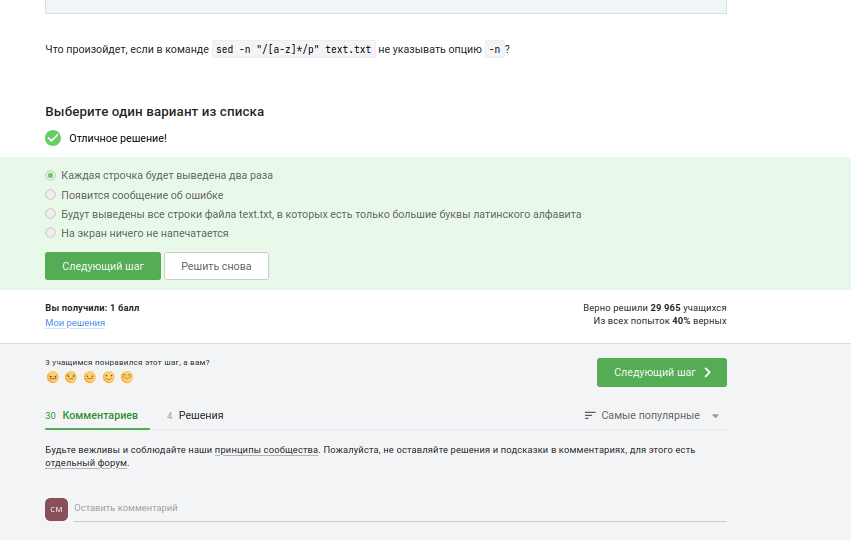{#fig-026 width=70%}

[A-Z]\{2,\} — две и более заглавные буквы. g — глобально. Пробелы сохраняются, т.к. мы заменяем только саму аббревиатуру ([рис. @fig-027]).

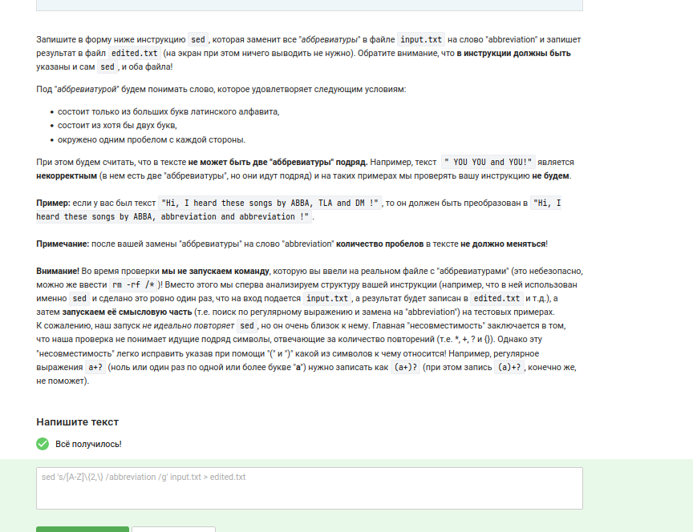{#fig-027 width=70%}

## Строим графики в gnuplot

Опция -p (--persist) в gnuplot предотвращает закрытие окон с графиками после завершения программы. Это удобно, когда нужно просмотреть график после выхода из gnuplot ([рис. @fig-028]).

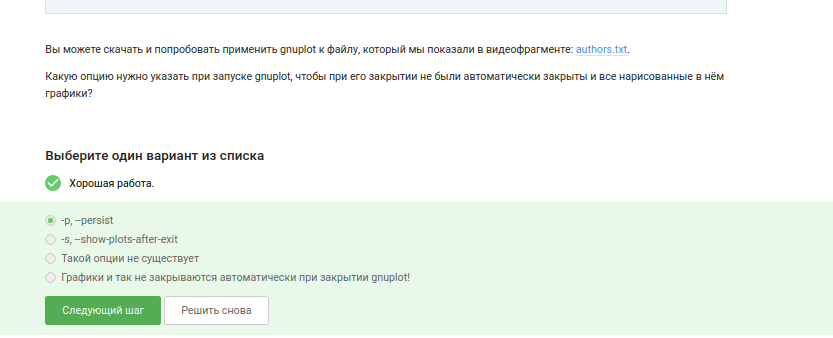{#fig-028 width=70%}

Правильным вариантом ответа является:

* Название – первое значение из второго столбца, нарисовано 9 точек (точка из первой строки пропущена)

   1. Команда set key autotitle columnhead заставляет gnuplot принудительно интерпретировать самую первую строку файла данных как заголовки (названия) столбцов для легенды графика.
   2. По условию, в файле нет названий столбцов, там сразу идут числа (10 строк). Из-за этой команды gnuplot всё равно заберёт первую строку под заголовки. Соответственно, для построения точек останется только 9 строк.
   3. За отрисовку значений по вертикальной оси (оси Y) отвечает второй столбец (using 1:2), поэтому заголовок (имя ряда данных в легенде) сформируется именно из первой строки второго столбца ([рис. @fig-029]).

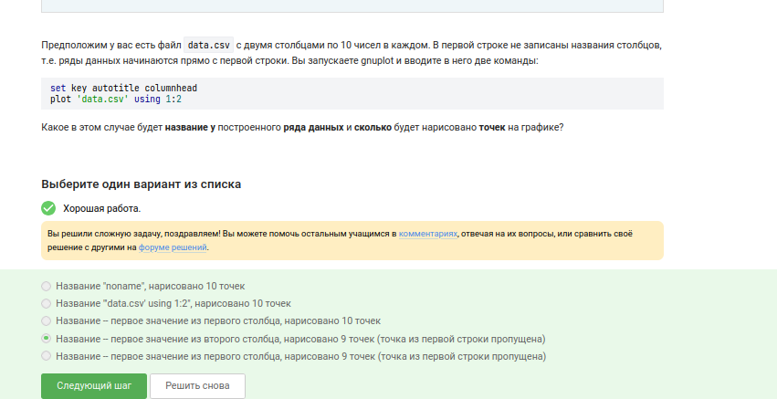{#fig-029 width=70%}

Команда set xtics создаёт пользовательские деления на оси X. Конкатенация строк выполняется через точку. Например, "point 1, value ".x1 при x1=0 даёт "point 1, value 0", после чего указывается координата x1.([рис. @fig-030]).

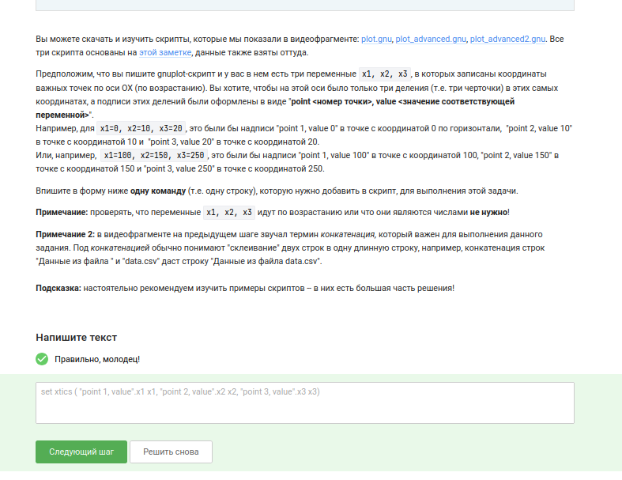{#fig-030 width=70%}

Для отражения графика относительно горизонтальной плоскости функция изменена с x^2+ y^2 на -x^2- y^2. Обратное вращение достигается изменением приращения угла: zrot = (zrot + 350) % 360 (350 эквивалентно -10). Ускорение в два раза — уменьшением паузы с 0.2 до 0.1 секунды ([рис. @fig-031]).

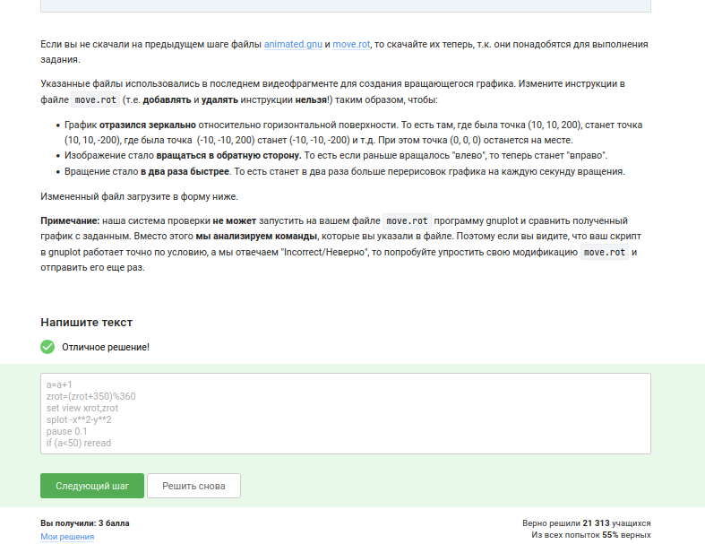{#fig-031 width=70%}

## Разное

Правильными ответами для этого задания на управление правами доступа (chmod) в Linux являются следующие варианты:

   1. chmod a+wx file.txt; chmod o-wx file.txt; chmod g-x file.txt
   * a+wx: добавляет запись и выполнение вообще всем (rwxrwxrwx).
      * o-wx: забирает их у остальных (o), возвращая к исходному r--.
      * g-x: забирает выполнение у группы, оставляя ей rw-. Цель достигнута.
   2. chmod u+wx file.txt; chmod g+w file.txt
   * Точечное добавление: владельцу (u) даются права на запись и запуск, группе (g) — только на запись. Идеальное прямое решение.
   3. chmod ug+w file.txt; chmod u+x file.txt
   * ug+w: добавляет право записи (w) одновременно владельцу и группе.
      * u+x: добавляет право выполнения (x) только владельцу. В итоге получается нужная комбинация ([рис. @fig-032]).

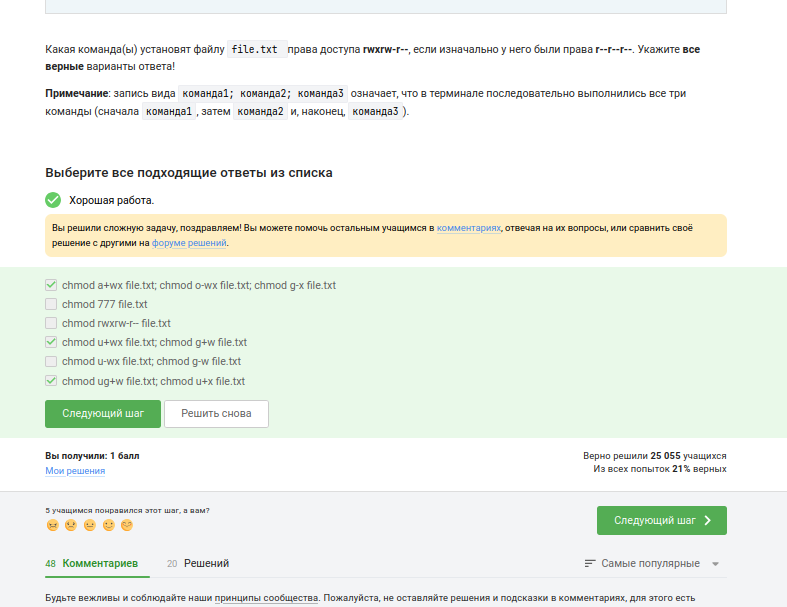{#fig-032 width=70%}

Изначально директория dir принадлежит пользователю root и группе root, а её права имеют вид rwxr-xr-x (755). Наш текущий пользователь — user, который состоит в группе group.
Чтобы user смог создавать файлы в этой директории, ему необходимо иметь права на запись (w) в эту директорию. Добиться этого можно несколькими путями, представленными в правильных ответах:

   1. sudo chown user dir
   Команда меняет владельца директории на user. Поскольку права для владельца равны rwx (первая тройка), user автоматически получает полный доступ, включая возможность создавать файлы.
   2. sudo chown user:group dir
   Аналогично предыдущему пункту, команда делает пользователя user владельцем (а также меняет группу на group). Как владелец, он получает права rwx.
   3. sudo chmod a+w dir
   Эта команда добавляет право на запись (w) абсолютно всем пользователям (a — all). Права директории станут rwxrwxrwx, и user сможет создавать в ней файлы, оставаясь в категории «остальные» ([рис. @fig-033]).

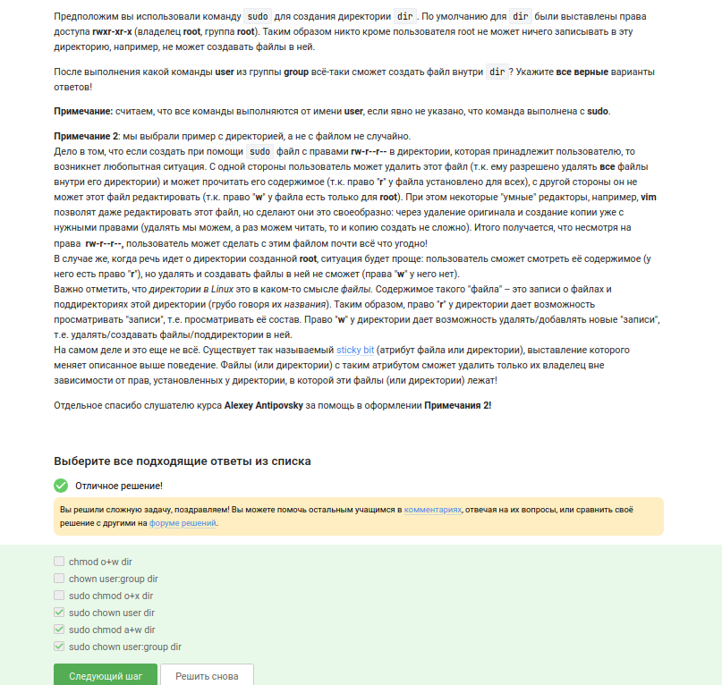{#fig-033 width=70%}

wc считает длину самой длинной строки, количество строк и символов, но не считает буквы и предложения ([рис. @fig-034]).

{#fig-034 width=70%}

Команда du -sh (или du -h -s) выводит суммарный размер текущей директории в человеко-читаемом формате (например, 2.4M). Опция -s (summary) показывает только общий размер, без перечисления файлов ([рис. @fig-035]).

{#fig-035 width=70%}

Самая короткая команда для создания трёх поддиректорий — mkdir dir{1..3}. Фигурные скобки в Bash генерируют последовательность: dir1, dir2, dir3 ([рис. @fig-036]).

{#fig-036 width=70%}

# Выводы

Выполнен третий этап внешнего курса на платформе Stepik.


# Список литературы{.unnumbered}

::: {#refs}
:::
