---
## Author
author:
  name: Мещерякова София Андреевна
  affiliation:
    - name: Российский университет дружбы народов
      country: Российская Федерация
      postal-code: 117198
      city: Москва
      address: ул. Миклухо-Маклая, д. 6
## Title
title: Лабораторная работа №1
date: today
date-format: "2026-03-06" # Example: 2025-09-06
---

# Информация

## Докладчик

:::::::::::::: {.columns align=center}
::: {.column width="70%"}

  * Мещерякова София Андреевна
  * Группа НПИбд-01-25
  * Студ. билет: 1032253634
  * [1032253634@rudn.ru"](mailto:1032253634@rudn.ru)
  * <https://github.com/SofiyaMeshcheryakova/study_2025-2026_os-intro>

:::
::::::::::::::

# Цель работы

Целью данной работы является приобретение практических навыков установки операционной системы на виртуальную машину, настройки минимально необходимых для дальнейшей работы сервисов.

# Задание

Здесь приводится описание задания в соответствии с рекомендациями методического пособия и выданным вариантом.

# Выполнение лабораторной работы

## ([рис. @fig-001])

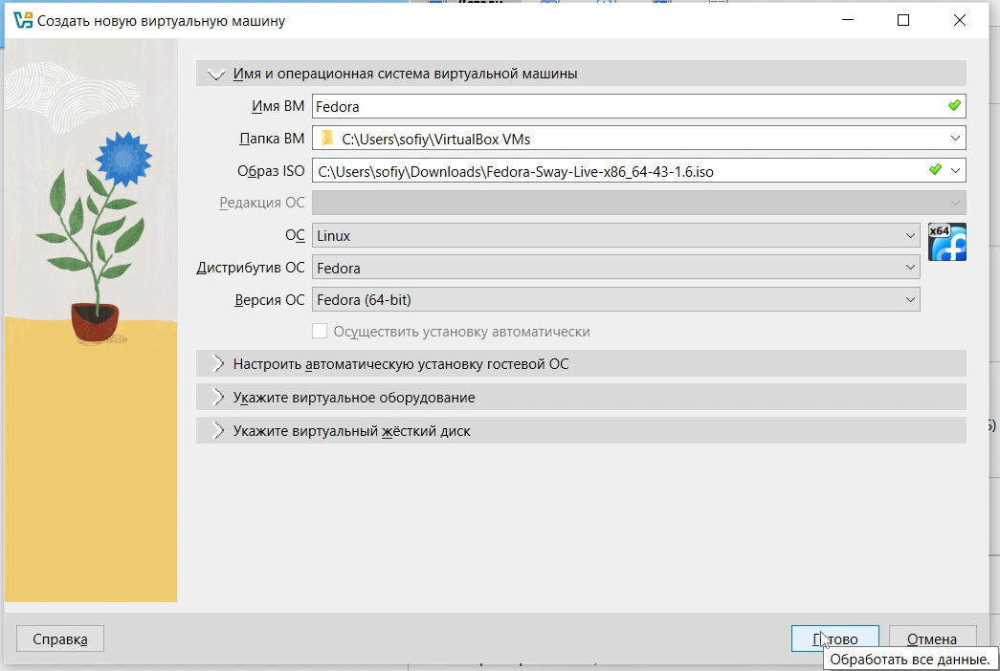{#fig-001 width=70%}

## ([рис. @fig-002]).

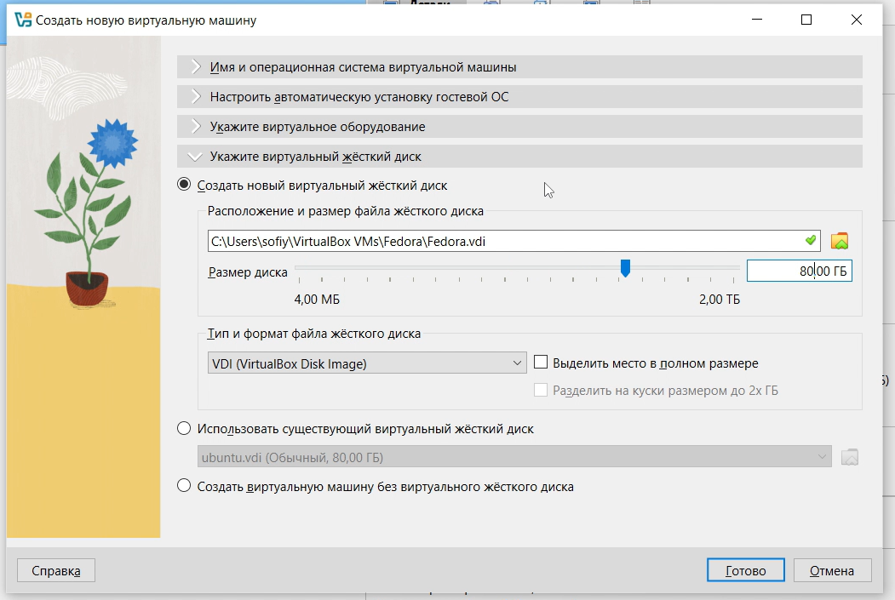{#fig-002 width=70%}

## ([рис. @fig-003]).

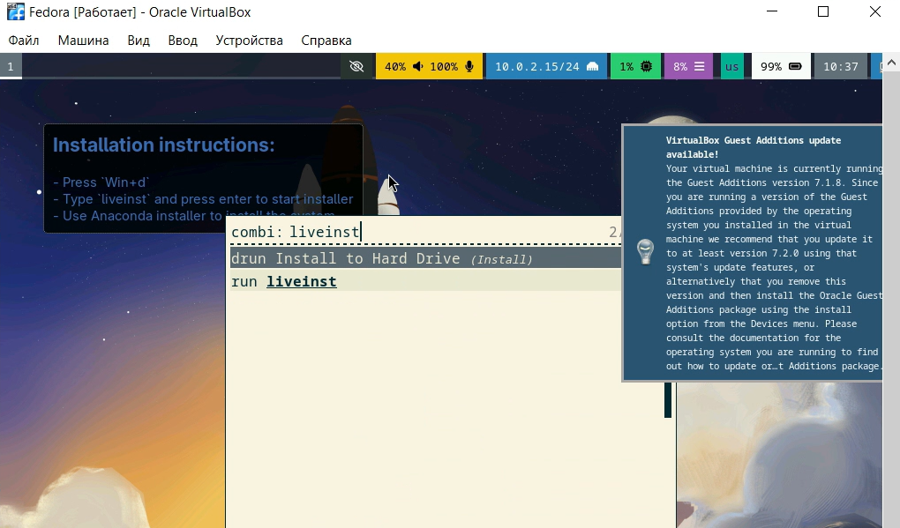{#fig-003 width=70%}

##([рис. @fig-004]).

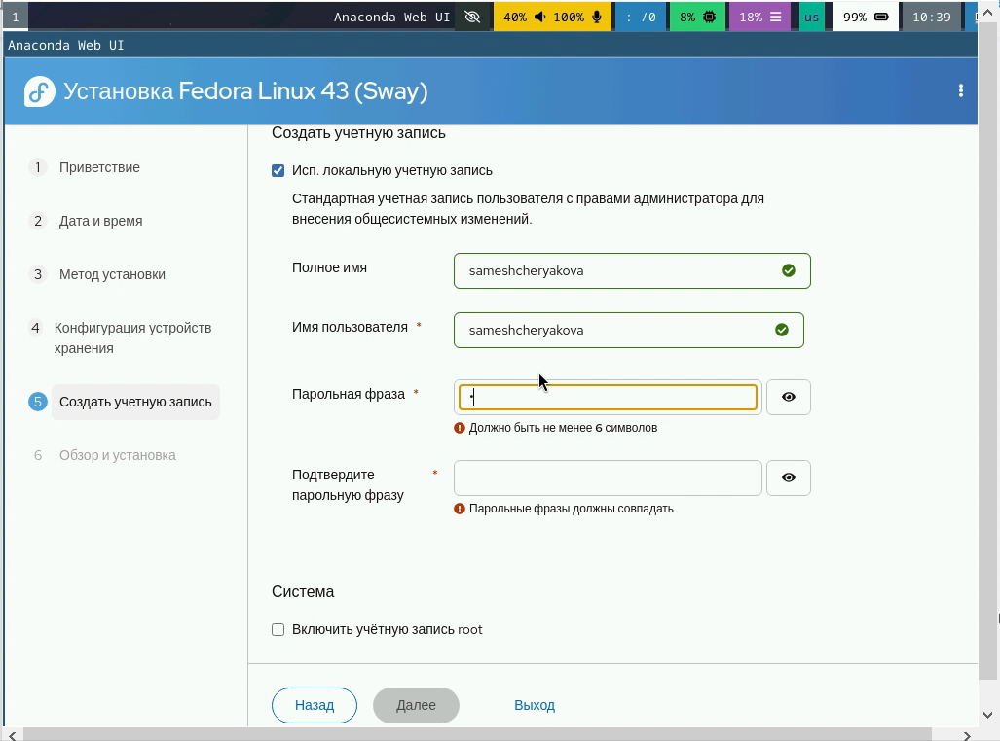{#fig-004 width=70%}

## ([рис. @fig-005]).

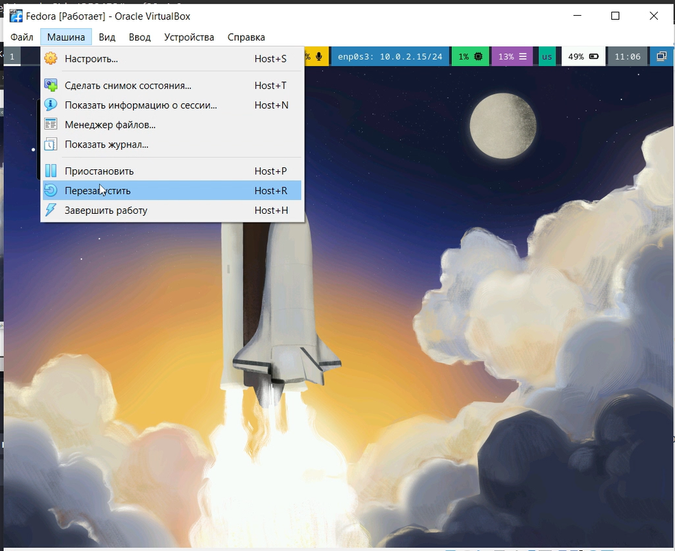{#fig-005 width=70%}

## ([рис. @fig-006]).

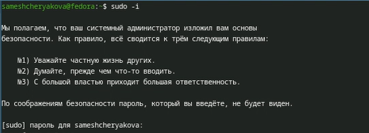{#fig-006 width=70%}

([рис. @fig-007]).

{#fig-007 width=70%}

## ([рис. @fig-008]).

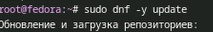{#fig-008 width=70%}

## ([рис. @fig-009]).

{#fig-009 width=70%}

## ([рис. @fig-010]).

{#fig-010 width=70%}

## ([рис. @fig-011]).

{#fig-011 width=70%}

## ([рис. @fig-012]).

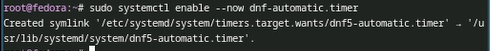{#fig-012 width=70%}

## ([рис. @fig-013]).

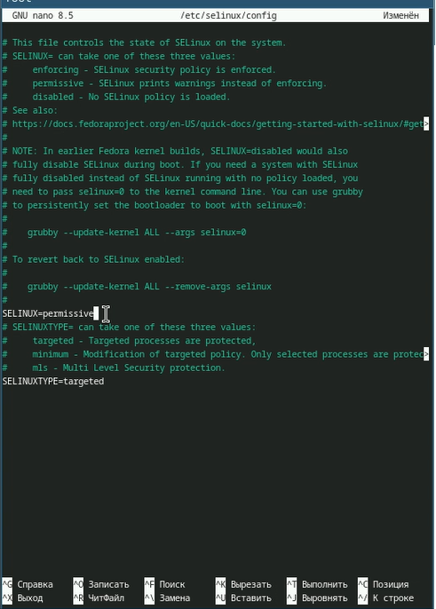{#fig-013 width=70%}

Отключим SELinux: В файле /etc/selinux/config заменим значение SELINUX=enforcing на значение SELINUX=permissive

## ([рис. @fig-014]).

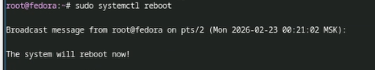{#fig-014 width=70%}

## ([рис. @fig-015]).

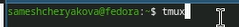{#fig-015 width=70%}

## ([рис. @fig-016]).

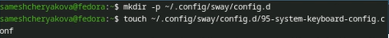{#fig-016 width=70%}

Создадим конфигурационный файл ~/.config/sway/config.d/95-system-keyboard-config.conf 

## ([рис. @fig-019]).

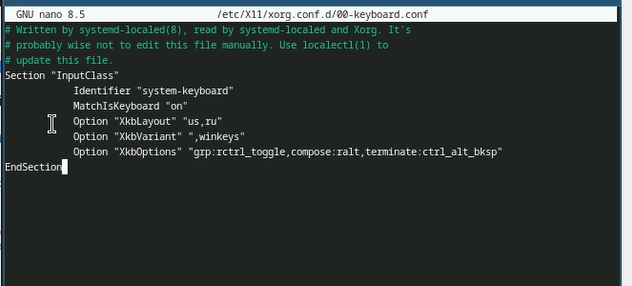{#fig-019 width=70%}

## ([рис. @fig-020]).

{#fig-020 width=70%}

## ([рис. @fig-021]).

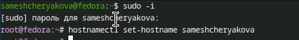{#fig-021 width=70%}

## ([рис. @fig-022]).

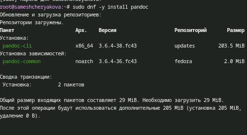{#fig-022 width=70%}

##  ([рис. @fig-023]).

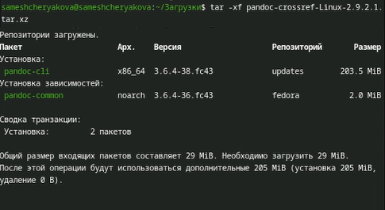{#fig-023 width=70%}

## ([рис. @fig-024]).

{#fig-024 width=70%}

## ([рис. @fig-025]).

{#fig-025 width=70%}

# Домашнее задание

## команда dmesg ([рис. @fig-026]).

{#fig-026 width=70%}

## Версия ядра Linux (Linux version) ([рис. @fig-027]).

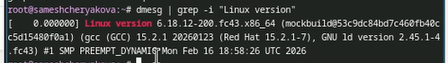{#fig-027 width=70%} 

## Частота процессора (Detected Mhz processor) ([рис. @fig-028]).

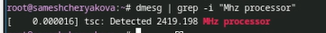{#fig-028 width=70%} 

## Модель процессора (CPU0) ([рис. @fig-029]).

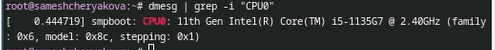{#fig-029 width=70%} 

## Объём доступной оперативной памяти (Memory available) ([рис. @fig-030]).

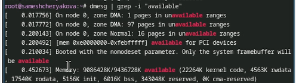{#fig-030 width=70%} 

## Тип обнаруженного гипервизора (Hypervisor detected) ([рис. @fig-031]).

{#fig-031 width=70%} 

##Тип файловой системы корневого раздела и последовательность монтирования файловых систем ([рис. @fig-032]) 

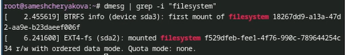{#fig-032 width=70%} 

# Выводы

- Мы установилии на виртуальную машину операционную систему Linux (дистрибутив Fedora Sway)

