---
## Author
author:
  name: Мещерякова София Андреевна
  affiliation:
    - name: Российский университет дружбы народов
      country: Российская Федерация
      postal-code: 117198
      city: Москва
      address: ул. Миклухо-Маклая, д. 6

## Title
title: "Отчет по лабораторной работе №2"
subtitle: "Первоначальна настройка git"
license: "CC BY"
---

# Цель работы

Изучить идеологию и применение средств контроля версий.

Освоить умения по работе с git.

# Задание

- Создать базовую конфигурацию для работы с git.
- Создать ключ SSH.
- Создать ключ PGP.
- Настроить подписи git.
- Зарегистрироваться на Github.
- Создать локальный каталог для выполнения заданий по предмету.

# Выполнение лабораторной работы

Устанавливаем git ([рис. @fig-001]).

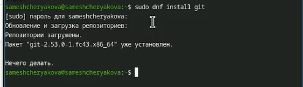{#fig-001 width=70%}

Устанавливаем gh ([рис. @fig-002]).

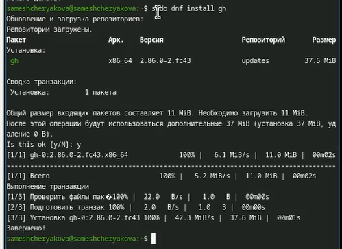{#fig-002 width=70%}

Зададим имя и email владельца репозитория ([рис. @fig-003]).

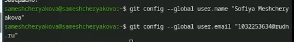{#fig-003 width=70%}

Настроим utf-8 в выводе сообщений git ([рис. @fig-004]).

{#fig-004 width=70%}

Зададим имя начальной ветки ([рис. @fig-005]).

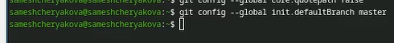{#fig-005 width=70%}

Настраиваем параметры autocrlf и safecrlf ([рис. @fig-006]).

{#fig-006 width=70%}

Создаем ssh ключи:

По алгоритму rsa с ключём размером 4096 бит ([рис. @fig-007]).

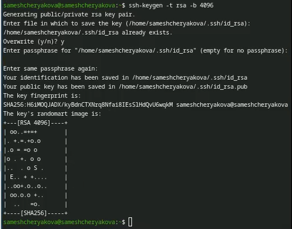{#fig-007 width=70%}

по алгоритму ed25519 ([рис. @fig-008]).

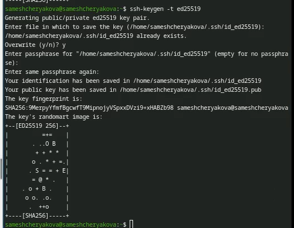{#fig-008 width=70%}

Добавим ssh ключ в github ([рис. @fig-08]).

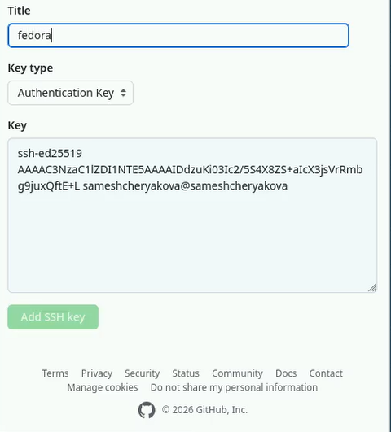{#fig-08 width=70%}

Генерируем ключ gpg ([рис. @fig-009]).

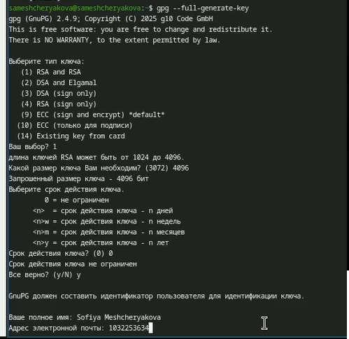{#fig-009 width=70%}

Выводим список ключей и копируем отпечаток приватного ключа ([рис. @fig-010]).

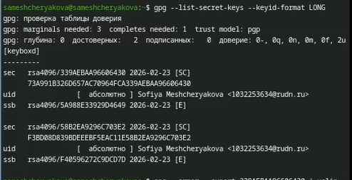{#fig-010 width=70%}

Cкопируем сгенерированный PGP ключ в буфер обмена ([рис. @fig-011]).

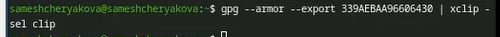{#fig-011 width=70%}

В настройках GitHub создадим новый GPG key.

Используя введёный email, укажем Git применять его при подписи коммитов ([рис. @fig-012]).

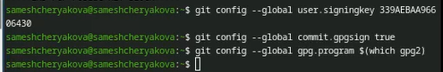{#fig-012 width=70%}

Авторизируемся с помощью gh ([рис. @fig-013]).

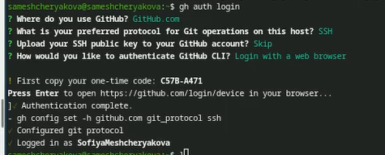{#fig-013 width=70%}

Cоздадим шаблон рабочего пространства([рис. @fig-014],[рис. @fig-015]).

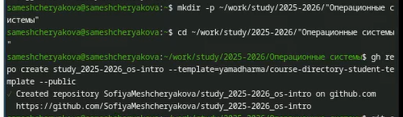{#fig-014 width=70%}

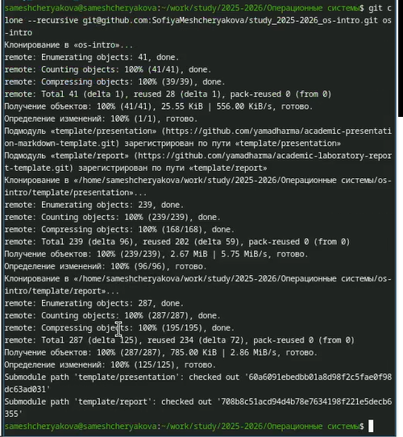{#fig-015 width=70%}

Перейдем в каталог курса ([рис. @fig-016]).

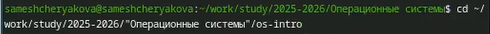{#fig-016 width=70%}

Удалим лишние файлы ([рис. @fig-017]).

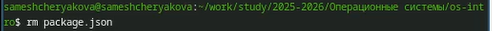{#fig-017 width=70%}

Создадим необходимые каталоги ([рис. @fig-018]).

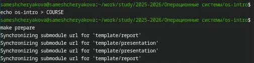{#fig-018 width=70%}

Отправим файлы на сервер ([рис. @fig-019],[рис. @fig-020]).

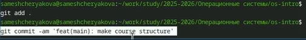{#fig-019 width=70%}

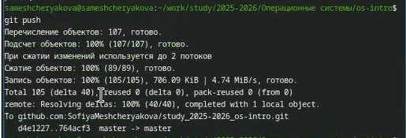{#fig-020 width=70%}

# Выводы

Мы познакомились с системой контроля git, выучили команды для работы с ним. А также создали репозиторий на платформе github, где в последствии будут храниться отчёты по лабораторным работам.

# Ответы на контрольные вопросы

1. VCS (Version Control System) — это софт для управления изменениями в коде.

Задачи: хранение истории изменений, возможность отката к старым версиям и совместная работа нескольких человек над одним проектом.

2. Понятия VCS

    Хранилище (Repository): база данных со всей историей проекта.
    
    Рабочая копия: текущие файлы на диске, которые вы редактируете.
    
    Commit: «снимок» (сохранение) изменений в истории.
    
    История: цепочка всех коммитов от начала проекта.
    
    Связь: вы меняете рабочую копию, делаете commit, и он навсегда заносится в историю внутри хранилища.

3. Централизованные (CVCS): один сервер, у пользователей только рабочая копия (пример: SVN). Без сети работать нельзя.

Децентрализованные (DVCS): каждый пользователь имеет полную копию всего хранилища (пример: Git). Можно работать офлайн, сервер нужен только для обмена правками.

4. Действия при единоличной работе:
    - Инициализация хранилища.
    
    - Изменение файлов.
    
    - Индексация (выбор файлов для сохранения).
    
    - Выполнение коммита.

5. Порядок работы с общим хранилищем

    Pull: получение чужих изменений с сервера.
    
    Edit: написание своего кода.
    
    Commit: сохранение у себя.
    
    Push: отправка своих коммитов на сервер.

6. Основные задачи Git

    Обеспечение целостности данных.
    
    Высокая скорость работы.
    
    Поддержка удобного ветвления (параллельной разработки).

7. Характеристика команд Git

    init: создать репозиторий.
    
    clone: скопировать проект с сервера.
    
    add: подготовить файлы к сохранению.
    
    commit: сохранить изменения.
    
    status: проверить, что изменено.
    
    push/pull: отправить/забрать данные с сервера.

8. Примеры использования

    Локально: git add . -> git commit -m "Fix bug".
    
    Удаленно: git push origin main (отправить ветку main на сервер).

9. Ветви — это параллельные линии разработки внутри одного проекта. Они нужны чтобы добавлять новые функции, не ломая стабильный код в основной ветке.

10. Чтобы игнорировать файлы необходимо записать имена файлов в файл .gitignore. Это необходимо, чтобы не засорять репозиторий (временные файлы, логи, пароли, папки зависимостей).

