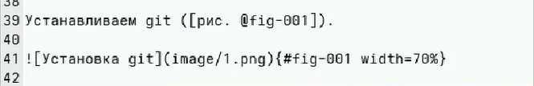
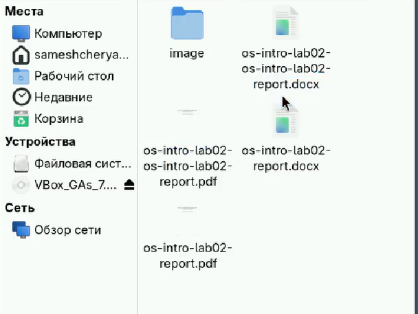

---
## Author
author:
  name: Мещерякова София Андреевна
  affiliation:
    - name: Российский университет дружбы народов
      country: Российская Федерация
      postal-code: 117198
      city: Москва
      address: ул. Миклухо-Маклая, д. 6
## Title
title: Лабораторная работа №3
date: today
date-format: "2026-03-06" # Example: 2025-09-06
---

# Информация

## Докладчик

:::::::::::::: {.columns align=center}
::: {.column width="70%"}

  * Мещерякова София Андреевна
  * Группа НПИбд-01-25
  * Студ. билет: 1032253634
  * [1032253634@rudn.ru"](mailto:1032253634@rudn.ru)
  * <https://github.com/SofiyaMeshcheryakova/study_2025-2026_os-intro>

:::
::::::::::::::

# Цель работы

Научиться оформлять отчёты с помощью легковесного языка разметки Markdown.

# Задание

 - Сделайте отчёт по предыдущей лабораторной работе в формате Markdown.
 
 - В качестве отчёта просьба предоставить отчёты в 3 форматах: pdf, docx и md (в архиве,
поскольку он должен содержать скриншоты, Makefile и т.д.)

# Выполнение лабораторной работы

## Открываем файл с шаблоном отчета в текстовом редакторе ([рис. @fig-001]).

{#fig-001 width=70%}

## Заполняем отчет. Добавляем изображения ([рис. @fig-002]).

{#fig-002 width=70%}

## Cоздаем файлы отчета с помощью команды make ([рис. @fig-003]).

{#fig-003 width=70%}

## Проверяем результат выполнения команды ([рис. @fig-004]).

{#fig-004 width=70%}

# Выводы

Мы научились работать с языком разметки Markdown, сформировали отчет по лабораторной работе № 2 в нескольких форматах.

