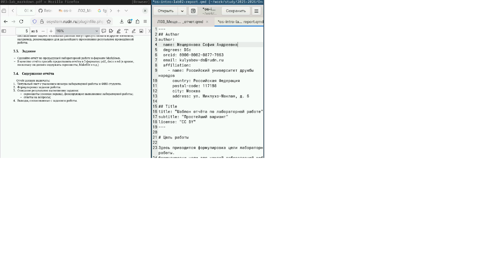
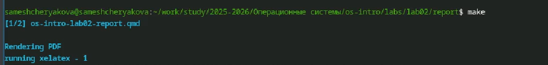

---
## Author
author:
  name: Мещерякова София Андреевна
  affiliation:
    - name: Российский университет дружбы народов
      country: Российская Федерация
      postal-code: 117198
      city: Москва
      address: ул. Миклухо-Маклая, д. 6

## Title
title: "Отчет по лабораторной работе №3"
subtitle: "Язык разметки Markdown"
license: "CC BY"
---

# Цель работы

Научиться оформлять отчёты с помощью легковесного языка разметки Markdown.

# Задание

 - Сделайте отчёт по предыдущей лабораторной работе в формате Markdown.
 
 - В качестве отчёта просьба предоставить отчёты в 3 форматах: pdf, docx и md (в архиве,
поскольку он должен содержать скриншоты, Makefile и т.д.)

# Выполнение лабораторной работы

Открываем файл с шаблоном отчета в текстовом редакторе ([рис. @fig-001]).

{#fig-001 width=70%}

Заполняем отчет. Добавляем изображения ([рис. @fig-002]).

{#fig-002 width=70%}

По завершении выполнения отчета открываем терминал. Находясь в соответствующей директории создаем файлы отчета с помощью команды make ([рис. @fig-003]).

{#fig-003 width=70%}

Проверяем результат выполнения команды ([рис. @fig-004]).

{#fig-004 width=70%}

# Выводы

Мы научились работать с языком разметки Markdown, сформировали отчет по лабораторной работе № 2 в нескольких форматах.
