---
## Author
author:
  name: Мещерякова София Андреевна
  affiliation:
    - name: Российский университет дружбы народов
      country: Российская Федерация
      postal-code: 117198
      city: Москва
      address: ул. Миклухо-Маклая, д. 6

## Title
title: "Отчет по лабораторной работе №4"
subtitle: "Продвинутое использование git"
license: "CC BY"
---

# Цель работы

Получение навыков правильной работы с репозиториями git.

# Задание

 - Выполнить работу для тестового репозитория.

 - Преобразовать рабочий репозиторий в репозиторий с git-flow и conventional commits.

# Выполнение лабораторной работы

Установим gitflow из коллекции репозиториев Copr ([рис. @fig-001], [рис. @fig-002]).

{#fig-001 width=70%}

{#fig-002 width=70%}

Установим Node.js ([рис. @fig-003]).

{#fig-003 width=70%}

Установим pnpm ([рис. @fig-004]).

{#fig-004 width=70%}

Запустите pnpm ([рис. @fig-005]).

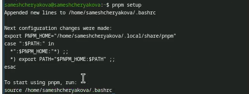{#fig-005 width=70%}

выполним команду source ~/.bashrc ([рис. @fig-006]).

{#fig-006 width=70%}

Установим commitizen для помощи в форматировании коммитов ([рис. @fig-007]).

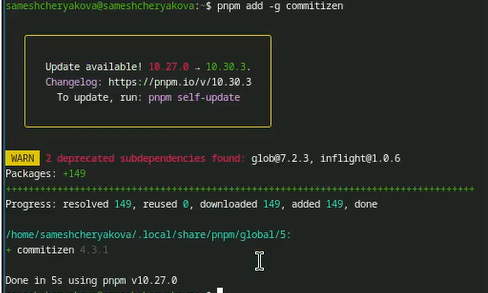{#fig-007 width=70%}

Cоздадим репозиторий на GitHub ([рис. @fig-008]).

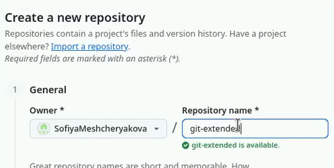{#fig-008 width=70%}

Клонирование репозитория и первый коммит ([рис. @fig-009]).

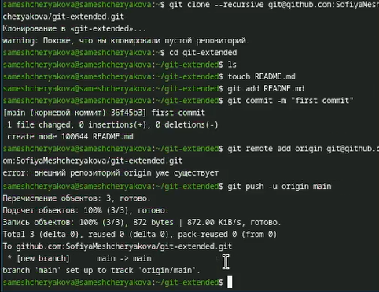{#fig-009 width=70%}

Конфигурация для пакетов Node.js ([рис. @fig-010]).

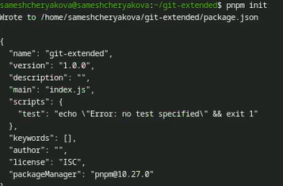{#fig-010 width=70%}

Заполняем несколько параметров пакета в файле package.json ([рис. @fig-011]).

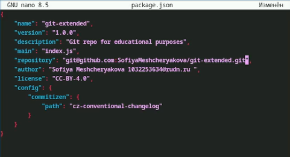{#fig-011 width=70%}
    
Добавим новые файлы ([рис. @fig-012]).

{#fig-012 width=70%}

Выполним коммит с помощью cz ([рис. @fig-013]).

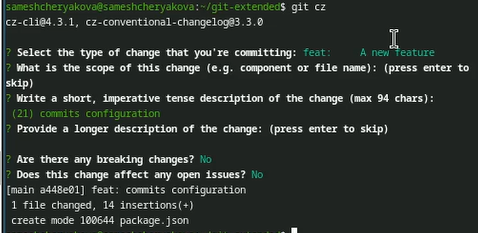{#fig-013 width=70%}

Отправим на github ([рис. @fig-014]).

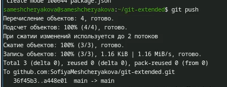{#fig-014 width=70%}

Теперь проинициализируем gitflow. Укажем названия веток и префикс для версий ([рис. @fig-015]).

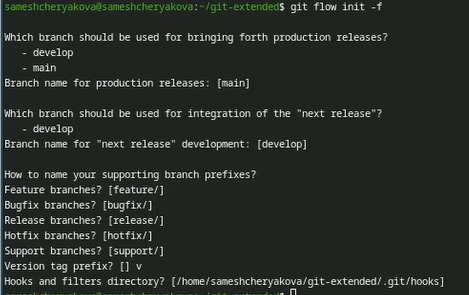{#fig-015 width=70%}

Выведем список веток и убедимся, что мы находимся в develop ([рис. @fig-016]).

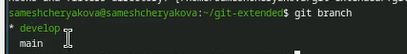{#fig-016 width=70%}

Загрузим весь репозиторий в хранилище ([рис. @fig-017]).

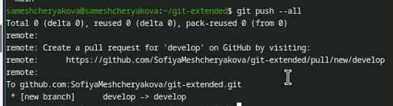{#fig-017 width=70%}

Установите внешнюю ветку как вышестоящую для этой ветки ([рис. @fig-018]).

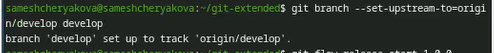{#fig-018 width=70%}

Создадим релиз с версией 1.0.0 ([рис. @fig-019]).

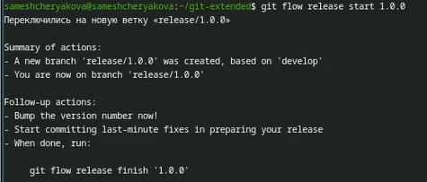{#fig-019 width=70%}

Создадим журнал изменений ([рис. @fig-020]).

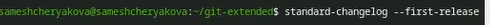{#fig-020 width=70%}

Добавим журнал изменений в индекс ([рис. @fig-021]).

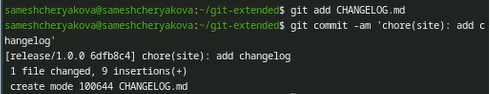{#fig-021 width=70%}

Зальём релизную ветку в основную ветку ([рис. @fig-022]).

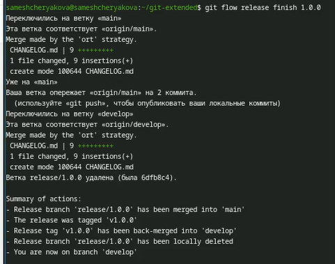{#fig-022 width=70%}

Отправим данные на github ([рис. @fig-023]).

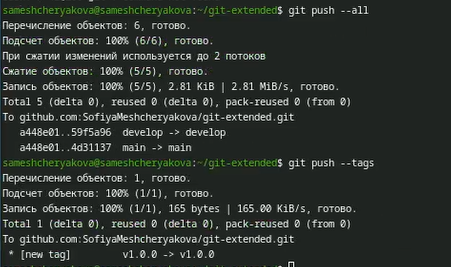{#fig-023 width=70%}

Создадим релиз на github  ([рис. @fig-024]).

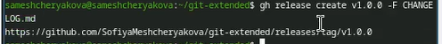{#fig-024 width=70%}

Создадим ветку feature и сразу сольём её с develop  ([рис. @fig-025], [рис. @fig-026]).

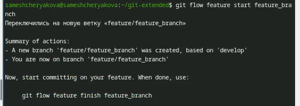{#fig-025 width=70%} 

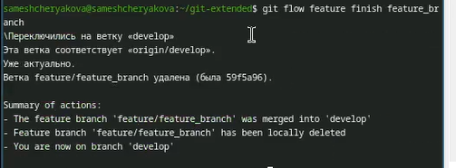{#fig-026 width=70%} 

Создадим ветку релиза 1.2.3 ([рис. @fig-027]).

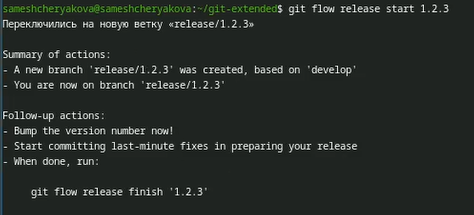{#fig-027 width=70%}

И в package.json сменим версию ([рис. @fig-028]).

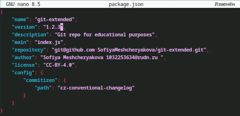{#fig-028 width=70%}

Создадим журнал изменений ([рис. @fig-029]).

{#fig-029 width=70%}

Добавим журнал изменений в индекс ([рис. @fig-030]).

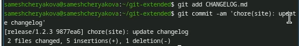{#fig-030 width=70%}

Зальём релизную ветку в основную ветку ([рис. @fig-031]).

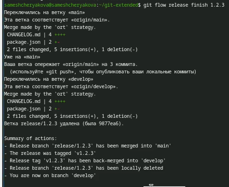{#fig-031 width=70%}

Отправим данные на github ([рис. @fig-032]).

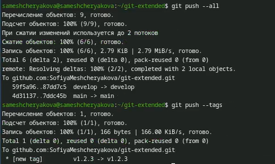{#fig-032 width=70%}

Создадим релиз на github  ([рис. @fig-033]).

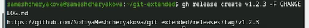{#fig-033 width=70%}

# Выводы

В результате выполнения лабораторной работы были получены навыки работы с расширенными возможностями git, а также были созданы релизы к репозиторию и дополнительные ветки, которые мы научились сливать в одну.
