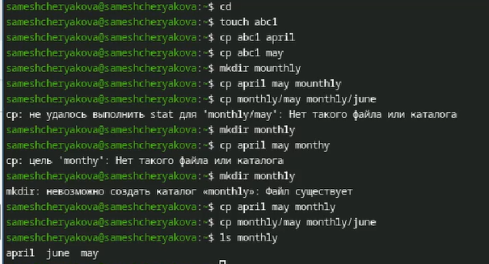
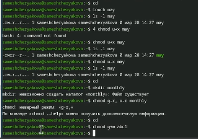
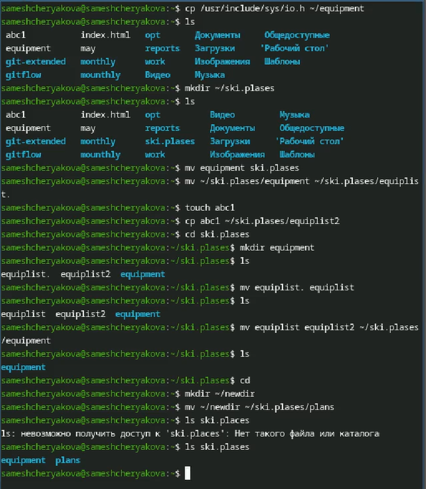
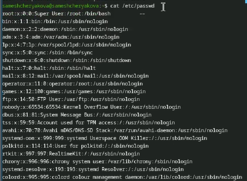
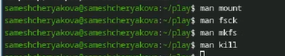

---
## Author
author:
  name: Мещерякова София Андреевна
  affiliation:
    - name: Российский университет дружбы народов
      country: Российская Федерация
      postal-code: 117198
      city: Москва
      address: ул. Миклухо-Маклая, д. 6
## Title
title: Лабораторная работа №7
date: today
date-format: "2026-03-28" # Example: 2025-09-06
---

# Информация

## Докладчик

:::::::::::::: {.columns align=center}
::: {.column width="70%"}

  * Мещерякова София Андреевна
  * Группа НПИбд-01-25
  * Студ. билет: 1032253634
  * [1032253634@rudn.ru"](mailto:1032253634@rudn.ru)
  * <https://github.com/SofiyaMeshcheryakova/study_2025-2026_os-intro>

:::
::::::::::::::

# Цель работы

Ознакомление с файловой системой Linux, её структурой, именами и содержанием
каталогов. Приобретение практических навыков по применению команд для работы
с файлами и каталогами, по управлению процессами (и работами), по проверке использования диска и обслуживанию файловой системы

# Задания

## Задания

1. Выполните все примеры, приведённые в первой части описания лабораторной работы.
2. Выполните следующие действия, зафиксировав в отчёте по лабораторной работе
используемые при этом команды и результаты их выполнения:
2.1. Скопируйте файл /usr/include/sys/io.h в домашний каталог и назовите его
equipment. Если файла io.h нет, то используйте любой другой файл в каталоге
/usr/include/sys/ вместо него.
2.2. В домашнем каталоге создайте директорию ~/ski.plases.
2.3. Переместите файл equipment в каталог ~/ski.plases.
2.4. Переименуйте файл ~/ski.plases/equipment в ~/ski.plases/equiplist.
2.5. Создайте в домашнем каталоге файл abc1 и скопируйте его в каталог
~/ski.plases, назовите его equiplist2.
2.6. Создайте каталог с именем equipment в каталоге ~/ski.plases.
2.7. Переместите файлы ~/ski.plases/equiplist и equiplist2 в каталог
~/ski.plases/equipment.
2.8. Создайте и переместите каталог ~/newdir в каталог ~/ski.plases и назовите
его plans.

## Задания

3. Определите опции команды chmod, необходимые для того, чтобы присвоить перечис-
ленным ниже файлам выделенные права доступа, считая, что в начале таких прав
нет:

3.1. drwxr--r-- ... australia

3.2. drwx--x--x ... play

3.3. -r-xr--r-- ... my_os

3.4. -rw-rw-r-- ... feathers

При необходимости создайте нужные файлы.

## Задания

4. Проделайте приведённые ниже упражнения, записывая в отчёт по лабораторной
работе используемые при этом команды:
4.1. Просмотрите содержимое файла /etc/password.
4.2. Скопируйте файл ~/feathers в файл ~/file.old.
4.3. Переместите файл ~/file.old в каталог ~/play.
4.4. Скопируйте каталог ~/play в каталог ~/fun.
4.5. Переместите каталог ~/fun в каталог ~/play и назовите его games.
4.6. Лишите владельца файла ~/feathers права на чтение.
4.7. Что произойдёт, если вы попытаетесь просмотреть файл ~/feathers командой
cat?
4.8. Что произойдёт, если вы попытаетесь скопировать файл ~/feathers?
4.9. Дайте владельцу файла ~/feathers право на чтение.
4.10. Лишите владельца каталога ~/play права на выполнение.
4.11. Перейдите в каталог ~/play. Что произошло?
4.12. Дайте владельцу каталога ~/play право на выполнение.

## Задания

5. Прочитайте man по командам mount, fsck, mkfs, kill и кратко их охарактеризуйте,
приведя примеры.

# Выполнение лабораторной работы

## Задание 1. Копирование файлов ([рис. @fig-001])

{#fig-001 width=70%}

## Задание 1. Перемещение файлов ([рис. @fig-002])

{#fig-002 width=70%}

## Задание 1. Перемещение файлов ([рис. @fig-003])

{#fig-003 width=70%}

## Задание 1. Права доступа ([рис. @fig-004])

{#fig-004 width=70%}

## Задание 2. Копирование и перемещение файлов ([рис. @fig-005])

{#fig-005 width=70%}

## Задание 3. Изменение прав доступа ([рис. @fig-006])

{#fig-006 width=70%}

## Задание 4. Выполнение задания ([рис. @fig-007])

{#fig-007 width=70%}

## Задание 4. Выполнение задания ([рис. @fig-008])

{#fig-008 width=70%}

## Задание 4. Выполнение задания ([рис. @fig-009])

{#fig-009 width=70%}

## Задание 5. С помощью man посмотрим описание команд ([рис. @fig-010])

mount - для монтирования файловых систем  

fsck - проверка файловой системы  

mkfs - создание файловой системы Linux  

kill - убить процесс  

{#fig-010 width=70%}

# Выводы

В результате выполнения лобораторной работы были получены навыки работы с файлами и каталогами, а также было получено понимание работы с правами доступа

# Список литературы{.unnumbered}

::: {#refs}
:::
