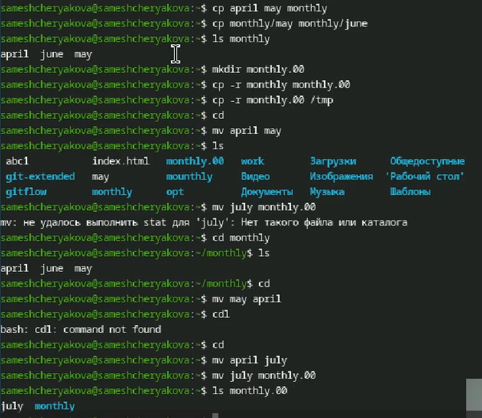
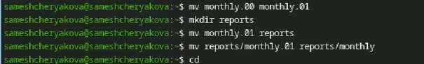
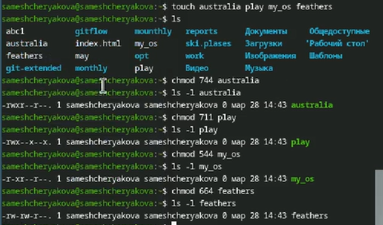
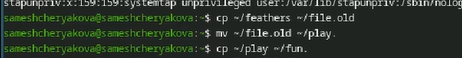

---
## Author
author:
  name: Мещерякова София Андреевна
  affiliation:
    - name: Российский университет дружбы народов
      country: Российская Федерация
      postal-code: 117198
      city: Москва
      address: ул. Миклухо-Маклая, д. 6

## Title
title: "Отчет по лабораторной работе №7"
subtitle: "Анализ файловой системы Linux.
Команды для работы с файлами и каталогами"
license: "CC BY"
---

# Цель работы

Ознакомление с файловой системой Linux, её структурой, именами и содержанием
каталогов. Приобретение практических навыков по применению команд для работы
с файлами и каталогами, по управлению процессами (и работами), по проверке использования диска и обслуживанию файловой системы

# Задание

1. Выполните все примеры, приведённые в первой части описания лабораторной работы.

2. Выполните следующие действия, зафиксировав в отчёте по лабораторной работе
используемые при этом команды и результаты их выполнения:

2.1. Скопируйте файл /usr/include/sys/io.h в домашний каталог и назовите его
equipment. Если файла io.h нет, то используйте любой другой файл в каталоге
/usr/include/sys/ вместо него.

2.2. В домашнем каталоге создайте директорию ~/ski.plases.

2.3. Переместите файл equipment в каталог ~/ski.plases.

2.4. Переименуйте файл ~/ski.plases/equipment в ~/ski.plases/equiplist.

2.5. Создайте в домашнем каталоге файл abc1 и скопируйте его в каталог
~/ski.plases, назовите его equiplist2.

2.6. Создайте каталог с именем equipment в каталоге ~/ski.plases.

2.7. Переместите файлы ~/ski.plases/equiplist и equiplist2 в каталог
~/ski.plases/equipment.

2.8. Создайте и переместите каталог ~/newdir в каталог ~/ski.plases и назовите
его plans.

3. Определите опции команды chmod, необходимые для того, чтобы присвоить перечис-
ленным ниже файлам выделенные права доступа, считая, что в начале таких прав
нет:

3.1. drwxr--r-- ... australia

3.2. drwx--x--x ... play

3.3. -r-xr--r-- ... my_os

3.4. -rw-rw-r-- ... feathers

При необходимости создайте нужные файлы.

4. Проделайте приведённые ниже упражнения, записывая в отчёт по лабораторной
работе используемые при этом команды:

4.1. Просмотрите содержимое файла /etc/password.

4.2. Скопируйте файл ~/feathers в файл ~/file.old.

4.3. Переместите файл ~/file.old в каталог ~/play.

4.4. Скопируйте каталог ~/play в каталог ~/fun.

4.5. Переместите каталог ~/fun в каталог ~/play и назовите его games.

4.6. Лишите владельца файла ~/feathers права на чтение.

4.7. Что произойдёт, если вы попытаетесь просмотреть файл ~/feathers командой
cat?

4.8. Что произойдёт, если вы попытаетесь скопировать файл ~/feathers?

4.9. Дайте владельцу файла ~/feathers право на чтение.

4.10. Лишите владельца каталога ~/play права на выполнение.

4.11. Перейдите в каталог ~/play. Что произошло?

4.12. Дайте владельцу каталога ~/play право на выполнение.

5. Прочитайте man по командам mount, fsck, mkfs, kill и кратко их охарактеризуйте,
приведя примеры.

# Выполнение лабораторной работы

Задание 1. Выполним примеры из теоритической части лабораторной работы 

Копирование файлов ([рис. @fig-001])

{#fig-001 width=70%}

Перемещение файлов ([рис. @fig-002], [@fig-003])

{#fig-002 width=70%}

{#fig-003 width=70%}

Права доступа ([рис. @fig-004])

{#fig-004 width=70%}

Задание 2. Копирование и перемещение файлов ([рис. @fig-005])

{#fig-005 width=70%}

Задание 3. Изменение прав доступа ([рис. @fig-006])

{#fig-006 width=70%}

Задание 4. Выполнение задания ([рис. @fig-007], [@fig-008], [@fig-009])

{#fig-007 width=70%}

{#fig-008 width=70%}

{#fig-009 width=70%}

Задание 5. С помощью man посмотрим описание команд ([рис. @fig-010])

mount - для монтирования файловых систем  

fsck - проверка файловой системы  

mkfs - создание файловой системы Linux  

kill - убить процесс  

{#fig-010 width=70%}

# Контрольные вопросы

1. btrfs - Корневая файловая система, относительно новая, в ней добавили много возможностей. Однако пока не является стандартом, так как всё ещё может быть нестабильной  

ext4 - Файловая система Linux, самая распространённая

2. Файловая система Linux имеет иерархическую структуру, начиная с корневой директории (/).  

Характеристика каждой директории первого уровня:  

/bin: В этой директории содержатся исполняемые файлы (бинарники), которые необходимы для базового функционирования системы в однопользовательском режиме.   

/boot: В этой директории хранятся файлы, необходимые для загрузки операционной системы. Это включает в себя ядро Linux (vmlinuz), файлы инициализации загрузчика и другие необходимые компоненты.  

/dev: Здесь содержатся файлы, представляющие устройства в системе.   

/etc: Эта директория содержит конфигурационные файлы для различных программ и служб, устанавливаемые в системе.  

/home: Здесь располагаются домашние каталоги пользователей. Каждый пользователь имеет свою собственную поддиректорию в этой директории для хранения своих файлов и настроек.  

/lib: В этой директории хранятся разделяемые библиотеки, которые используются программами во время выполнения.  

/media: Эта директория предназначена для временного монтирования съемных носителей, таких как USB-флешки, CD-ROMы и другие.  

/mnt: Здесь монтируются временные файловые системы. Обычно используется для временного монтирования файловых систем извне основной файловой системы, например, сетевых ресурсов.  

/opt: В этой директории устанавливаются дополнительные программы, не входящие в стандартную поставку дистрибутива.  

/proc: Эта директория представляет виртуальную файловую систему, содержащую информацию о запущенных процессах, настройках ядра и другие системные параметры.  

3. mount  

4. Отсутствие синхронизации, аварийное завершение работы. Исправляется с помощью утилит для проверки дисков 

5. mkfs  

6. cat - выводит всё  

tail - выводит последние 10 строк  

head - выводит первые 10 строк  

7. Копирование, копирование с новым именем, копирование каталогов  

8. Перемещение, перемещение с новым именем, перемещение каталогов  

9. Право читать, записывать и запускать файл. Меняются с помощью chmod  

# Выводы

В результате выполнения лобораторной работы были получены навыки работы с файлами и каталогами, а также было получено понимание работы с правами доступа

# Список литературы{.unnumbered}

::: {#refs}
:::
