---
## Author
author:
  name: Мещерякова София Андреевна
  affiliation:
    - name: Российский университет дружбы народов
      country: Российская Федерация
      postal-code: 117198
      city: Москва
      address: ул. Миклухо-Маклая, д. 6
## Title
title: Лабораторная работа №
date: today
date-format: "2026-03-28" # Example: 2025-09-06
---

# Информация

## Докладчик

:::::::::::::: {.columns align=center}
::: {.column width="70%"}

  * Мещерякова София Андреевна
  * Группа НПИбд-01-25
  * Студ. билет: 1032253634
  * [1032253634@rudn.ru"](mailto:1032253634@rudn.ru)
  * <https://github.com/SofiyaMeshcheryakova/study_2025-2026_os-intro>

:::
::::::::::::::

## Цель работы

Освоение основных возможностей командной оболочки Midnight Commander. Приоб-
ретение навыков практической работы по просмотру каталогов и файлов; манипуляций
с ними.

# Выполнение лабораторной работы

## Посмотрим информацию о mc ([рис. @fig-001])

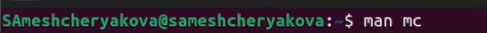{#fig-001 width=70%}

## запустим mc  ([рис. @fig-002])

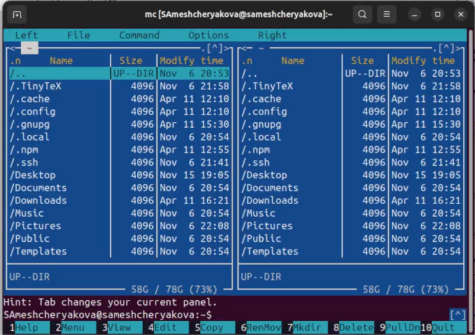{#fig-002 width=70%}

## Через меню Файл скопируем каталог ([рис. @fig-003])

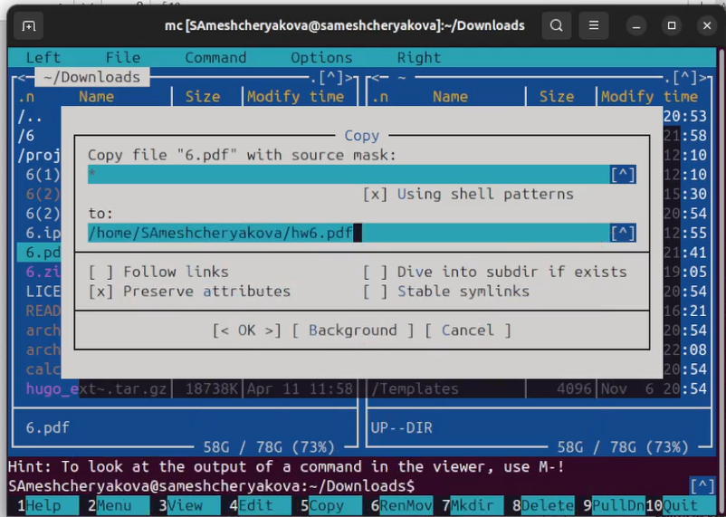{#fig-003 width=70%}

## Через меню Файл переместим каталог ([рис. @fig-004]).

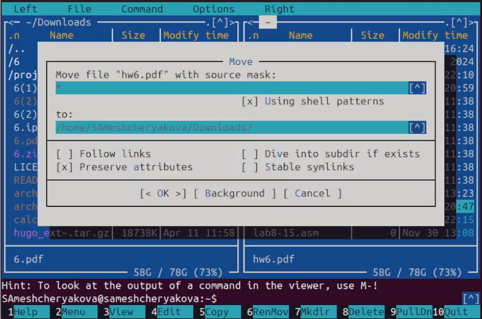{#fig-004 width=70%}

## Откроем через левую панель информацию ([рис. @fig-005]).

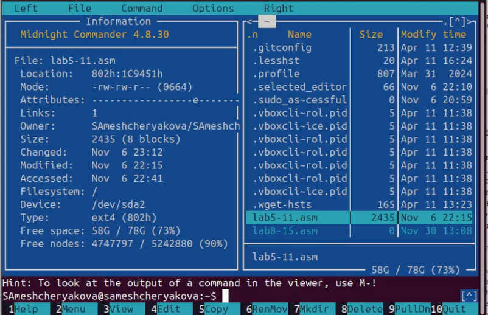{#fig-005 width=70%}

## Откроем через правую панель быстрый просмотр ([рис. @fig-006]).

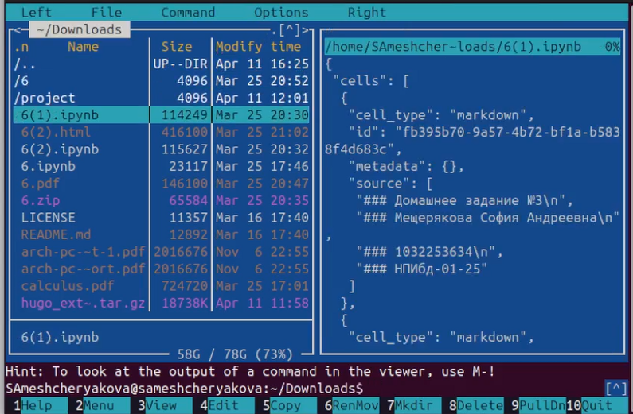{#fig-006 width=70%}

## Откроем через правую панель древо каталогов ([рис. @fig-008]).

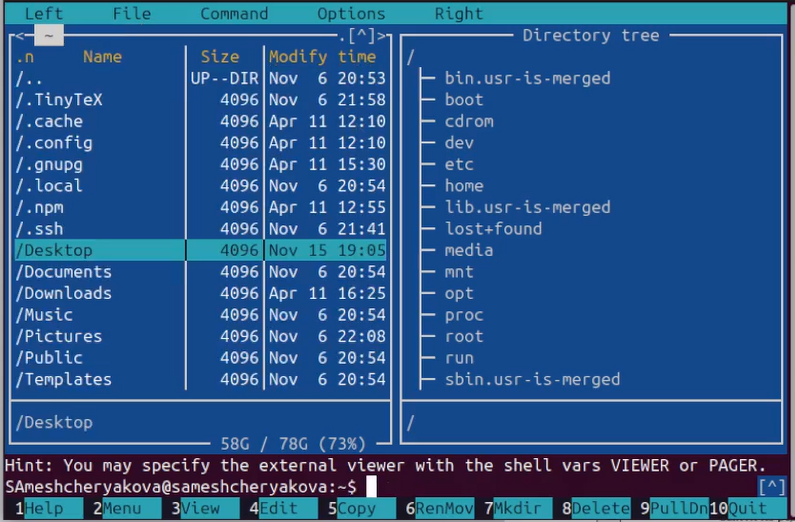{#fig-008 width=70%}

## С помощью F4 отредактируем файл ([рис. @fig-009]).

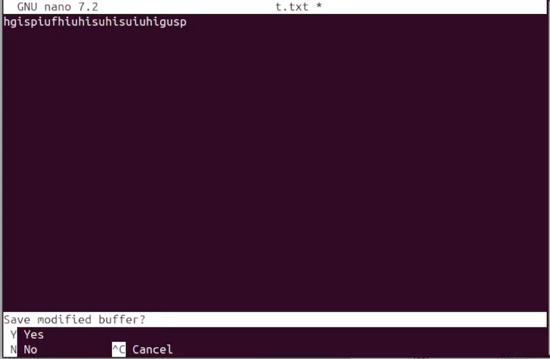{#fig-009 width=70%}

Выходим из редактора без сохранения (ctrl+x -> n).

## Создадим каталог через меню Команда ([рис. @fig-010]).

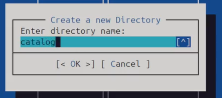{#fig-010 width=70%}

## Скопируем каталог через меню Команда ([рис. @fig-011]).

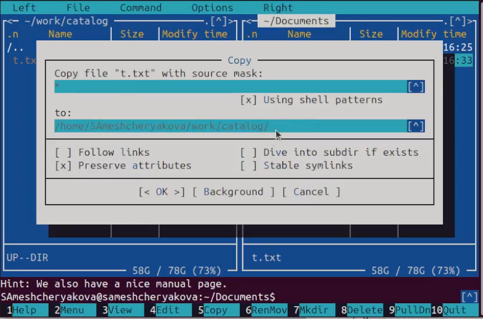{#fig-011 width=70%}

## Найдём файл .asm, содержащий mov через меню Команда ([рис. @fig-012]).

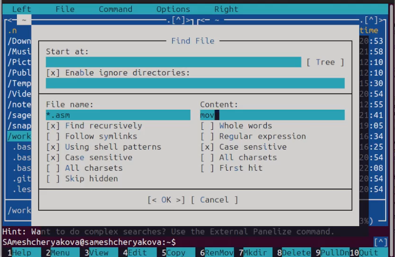{#fig-012 width=70%}

## Откроем через Команда историю и выполним команду оттуда ([рис. @fig-013]).

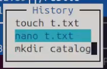{#fig-013 width=50%}

## Через Команда откроем каталоги быстрого доступа ([рис. @fig-014]).

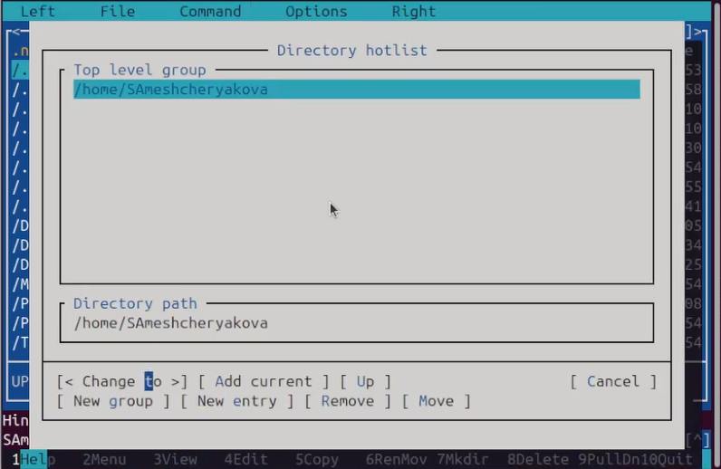{#fig-014 width=70%}

## Откроем файл меню ([рис. @fig-015]).

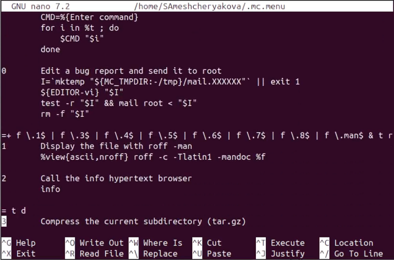{#fig-015 width=70%}

## Откроем файл расширений ([рис. @fig-016]).

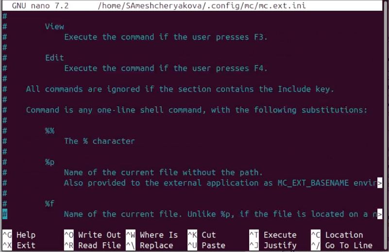{#fig-016 width=70%}

## Посмотрим настройки ([рис. @fig-017]).

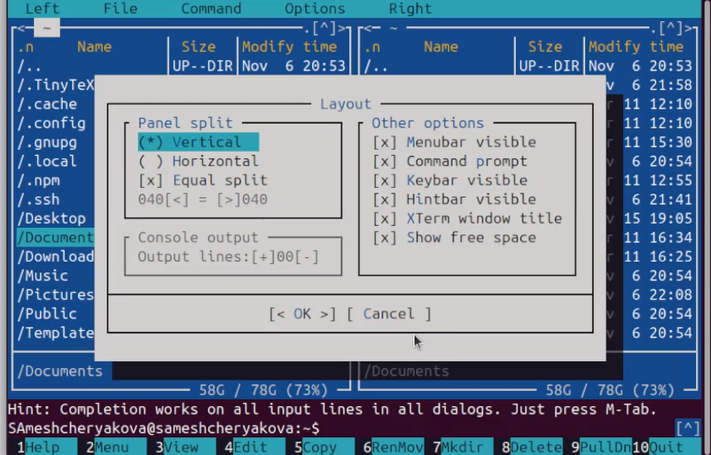{#fig-017 width=70%}

## Посмотрим настройки ([рис. @fig-018]).

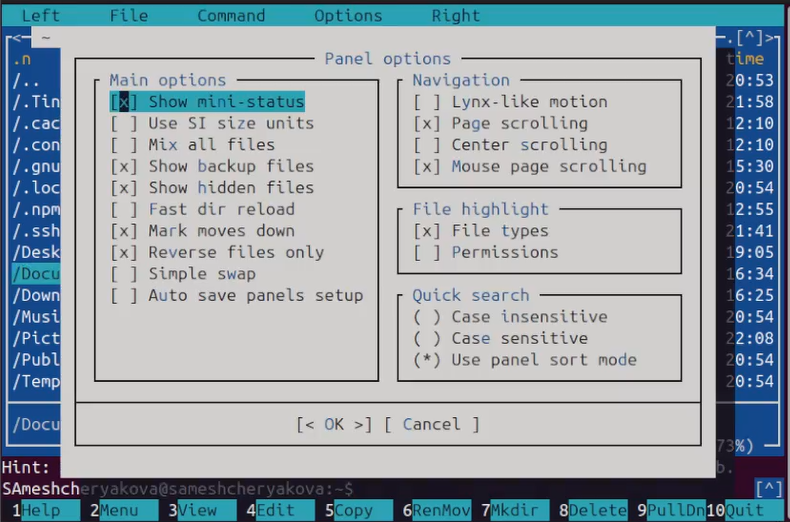{#fig-018 width=70%}

Создадим файл и вставим в него что-нибудь ([рис. @fig-019]).

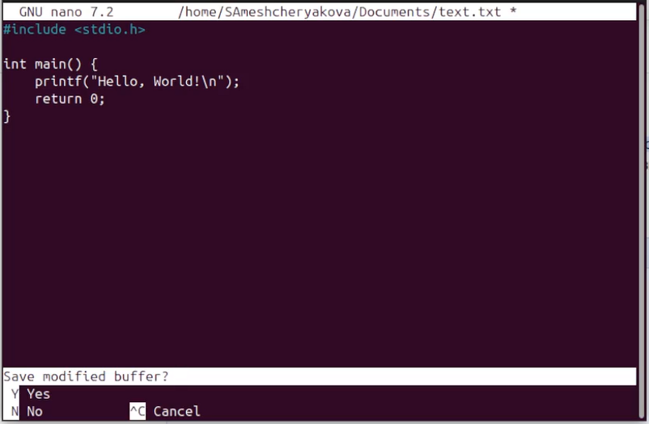{#fig-019 width=70%}

## Переместим строку через F6 ([рис. @fig-020]).

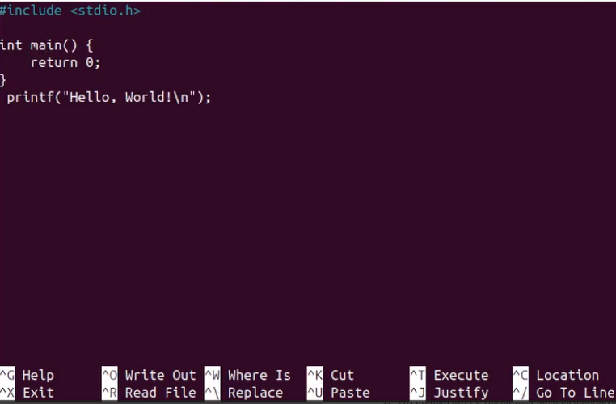{#fig-020 width=70%}

## Скопируем строку и вставим ее через  ctrl + u ([рис. @fig-021]).

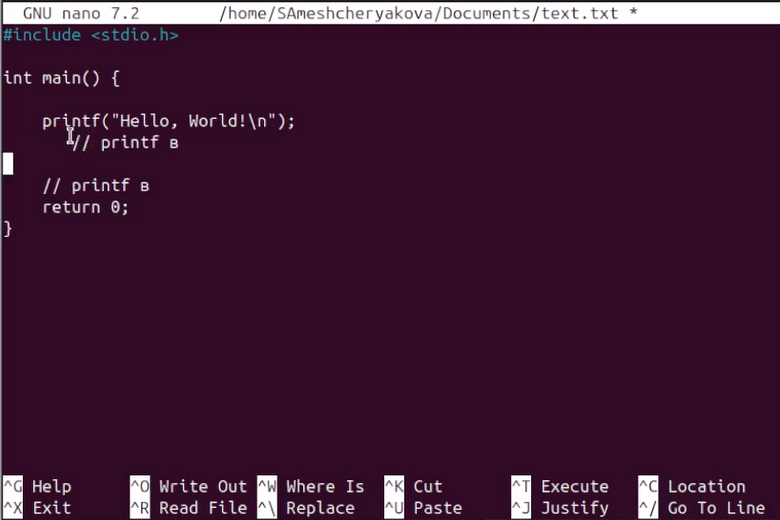{#fig-021 width=70%}

## Отменим действие через ctrl + м + u ([рис. @fig-022]).

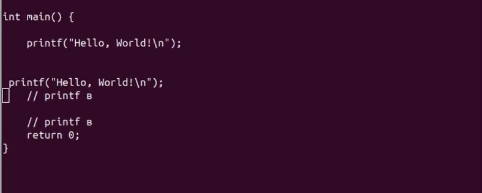{#fig-022 width=70%}

## Напишем что-нибудь в начале и в конце файла (ctrl + /) ([рис. @fig-023]).

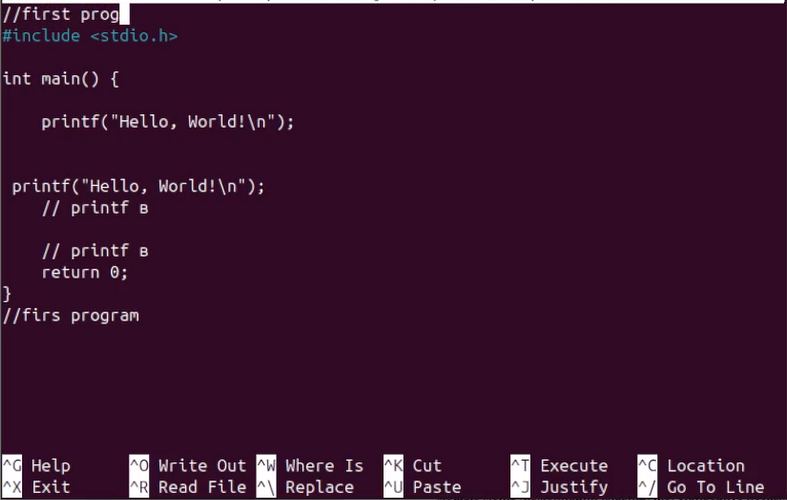{#fig-023 width=70%}

## И откроем исходный код, где выключим подсветку синтаксиса ([рис. @fig-024]).

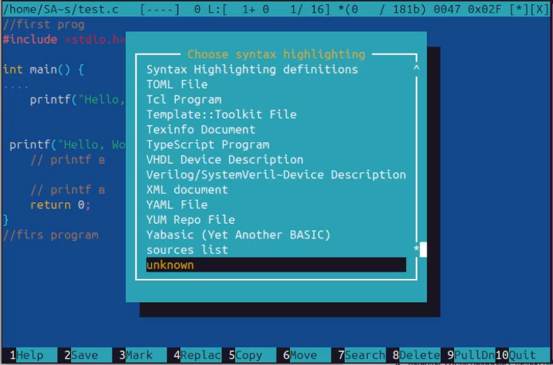{#fig-024 width=70%}

## Bыключим подсветку синтаксиса ([рис. @fig-025]).

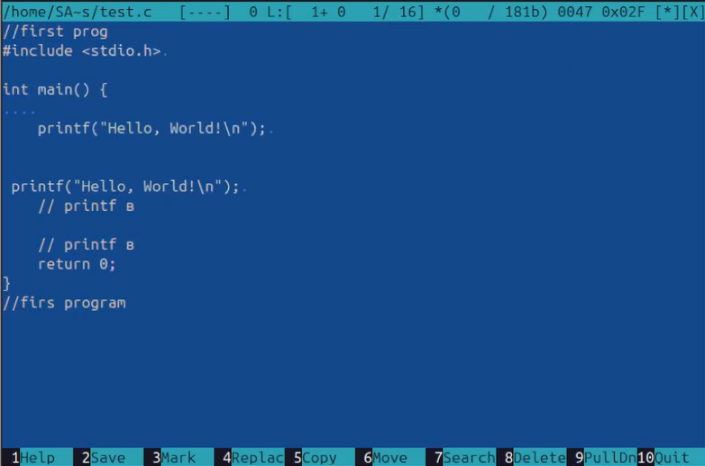{#fig-025 width=70%}

# Выводы

## Выводы

В результате выполнения лабораторной работы появились навыки работы с mc

