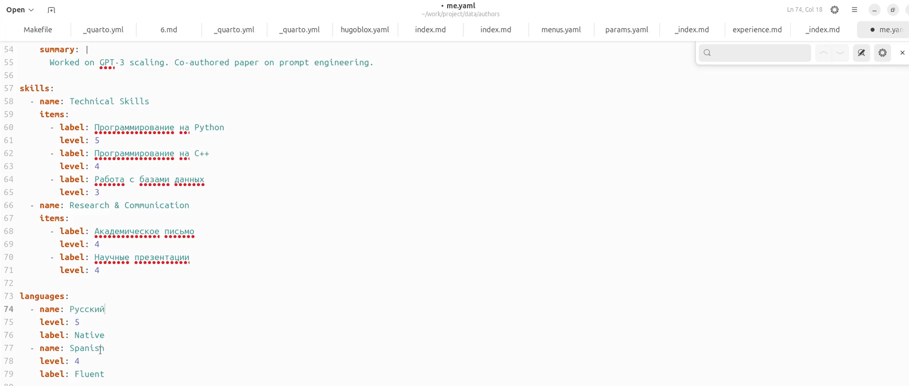
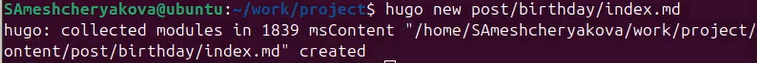
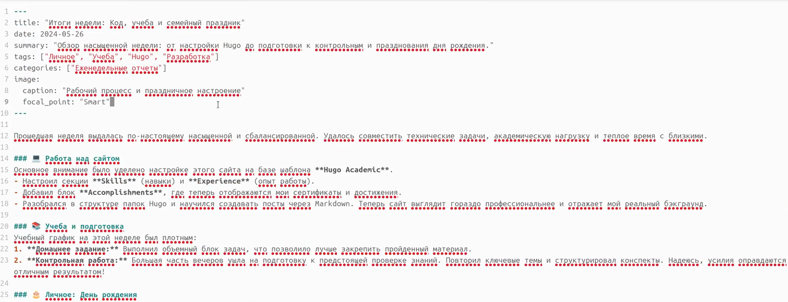
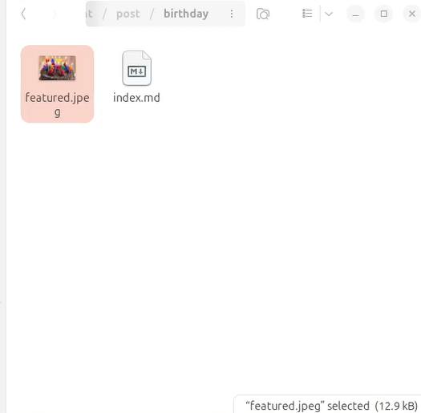
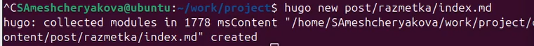
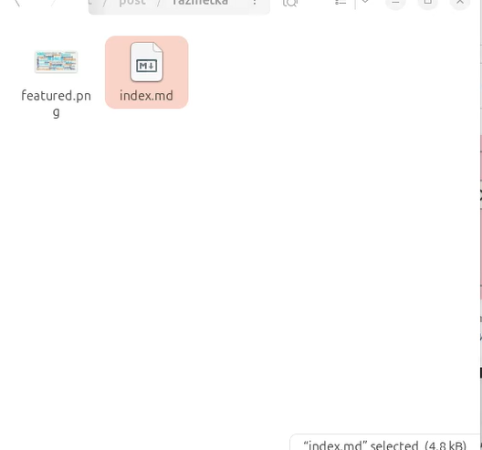
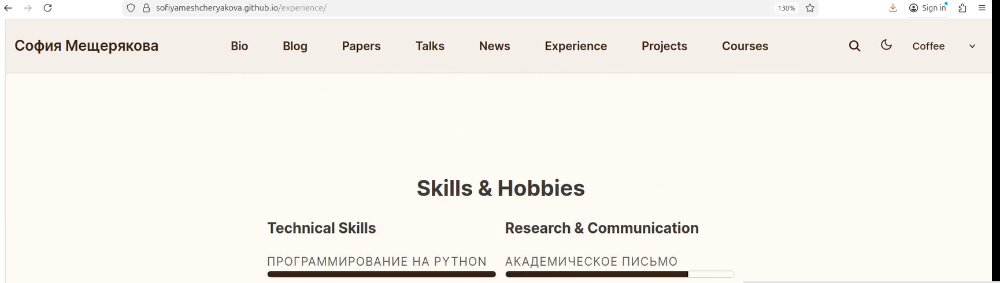

---
## Author
author:
  name: Мещерякова София Андреевна
  affiliation:
    - name: Российский университет дружбы народов
      country: Российская Федерация
      postal-code: 117198
      city: Москва
      address: ул. Миклухо-Маклая, д. 6
## Title
title: Индивидуальный проект. Этап 1
date: today
date-format: "2026-03-07" # Example: 2025-09-06
---

# Информация

## Докладчик

:::::::::::::: {.columns align=center}
::: {.column width="70%"}

  * Мещерякова София Андреевна
  * Группа НПИбд-01-25
  * Студ. билет: 1032253634
  * [1032253634@rudn.ru"](mailto:1032253634@rudn.ru)
  * <https://github.com/SofiyaMeshcheryakova/study_2025-2026_os-intro>

:::
::::::::::::::

# Цель работы

Добавление информации о навыках и создание постов на сайте.

# Выполнение лабораторной работы

## Редактируем файл me.yaml, чтобы добавить необходимую информацию  ([рис. @fig-001])

{#fig-001 width=70%}

## Создем новый пост ([рис. @fig-002])

{#fig-002 width=70%}

## Редактируем файл index.md в нужной папке ([рис. @fig-003])

{#fig-003 width=70%}

## Добавляем фото ([рис. @fig-004])

{#fig-004 width=70%}

## Создаем новый пост ([рис. @fig-005])

{#fig-005 width=70%}

## Добавляем фото и реактируем файл index.md ([рис. @fig-006])

{#fig-006 width=70%}

## Загружаем изменения на гитхаб.

## Вид сайта ([рис. @fig-007])

{#fig-007 width=70%}

# Выводы

Добавили информацию о своих навыках. Создали новые посты на странице blog.
